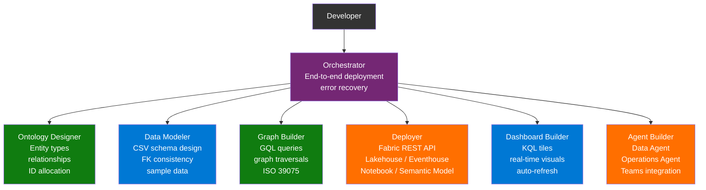
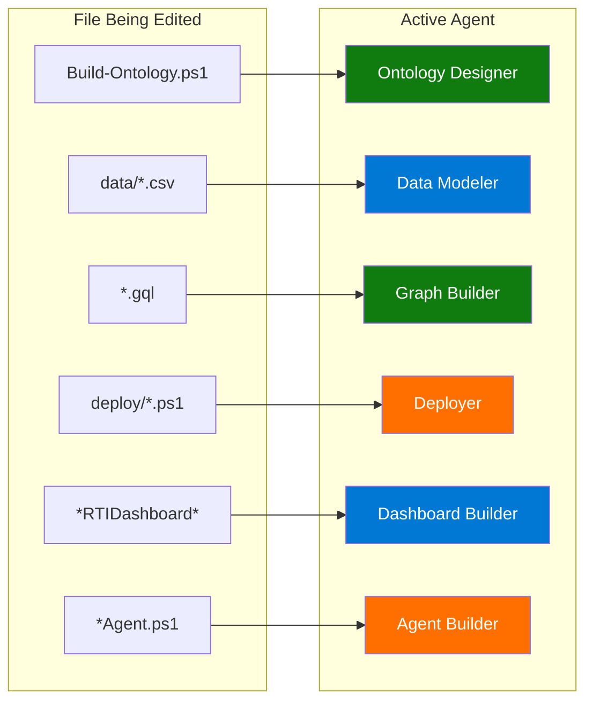
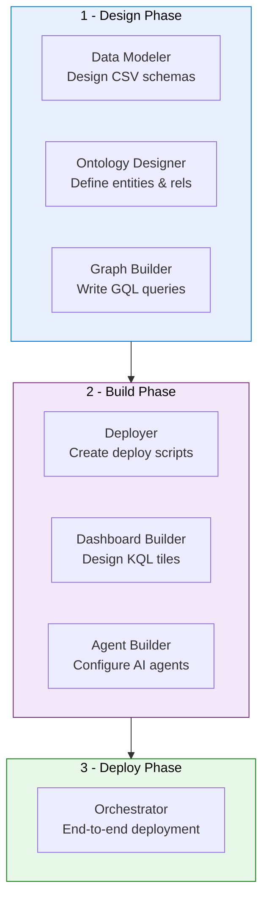

<p align="center">
  
</p>

<p align="center">
  
  
</p>

<h1 align="center">:robot: Multi-Agent Architecture</h1>

<p align="center">
  <b>7 specialized Copilot agents for ontology design and deployment</b>
</p>

---

## :globe_with_meridians: Overview

This project uses a **multi-agent architecture** with 7 specialized GitHub Copilot agents and a shared instruction set. Each agent has deep expertise in a specific phase of ontology design and deployment.



---

## :busts_in_silhouette: Agent Overview

| | Agent | Focus | Key Files | Activates On |
|:---:|-------|-------|-----------|:------------:|
| :dart: | **Orchestrator** | End-to-end deployment, domain selection, error recovery | `Deploy-Ontology.ps1`, `Deploy-GenericOntology.ps1` | `Deploy-*.ps1` (root) |
| :dna: | **Ontology Designer** | Entity types, relationships, ID allocation, property modelling | `Build-Ontology.ps1` per domain | `Build-Ontology.ps1` |
| :bar_chart: | **Data Modeler** | CSV schema design, FK consistency, sample data generation | `data/*.csv` per domain | `data/*.csv` |
| :spider_web: | **Graph Builder** | GQL queries, graph traversal patterns, Fabric Graph Model | `GraphQueries.gql`, `Deploy-GraphQuerySet.ps1` | `*.gql` |
| :rocket: | **Deployer** | Fabric REST API, Lakehouse, Eventhouse, Notebook, Semantic Model | `deploy/*.ps1` | `deploy/*.ps1` |
| :bar_chart: | **Dashboard Builder** | RTI Dashboard KQL tiles, real-time visualizations | `Deploy-RTIDashboard.ps1` | `*RTIDashboard*` |
| :robot: | **Agent Builder** | Data Agent, Operations Agent, Teams integration | `Deploy-DataAgent.ps1`, `Deploy-OperationsAgent.ps1` | `*Agent.ps1` |

---

## :jigsaw: How Agents Activate

Agents auto-activate based on the file you are editing in VS Code:



---

## :shield: Shared Constraints

All agents follow the hard constraints defined in `.github/agents/shared.instructions.md`:

| | Constraint | Detail |
|:---:|-----------|--------|
| :wrench: | **PowerShell 5.1 compatibility** | No `&&` operator; use `;` for chaining. Manual JSON for large payloads. |
| :key: | **Deterministic GUIDs** | MD5 hash of name strings for idempotent deployments |
| :arrows_counterclockwise: | **Fabric REST API conventions** | 202 polling, 429 retry-after with exponential backoff, LRO handling |
| :id: | **Ontology ID allocation** | Entities: 1001+, Properties: 2001+, Relationships: 3001+, Timeseries: 4001+ |
| :outbox_tray: | **OneLake DFS upload** | PUT resource=file, then PATCH append, then PATCH flush |

---

## :mag: Agent Details

<details>
<summary><h3>:dart: Orchestrator</h3></summary>

**Responsibility:** End-to-end deployment coordination across all Fabric items.

**Expertise:**
- Multi-domain deployment sequencing (Lakehouse then Notebook then Semantic Model then Ontology then etc.)
- Error recovery and retry logic
- Parameter resolution and validation
- Domain selection and configuration

**Key Commands:**
```powershell
.\Deploy-Ontology.ps1 -WorkspaceId "guid" -OntologyType SmartBuilding
.\Deploy-OilGasOntology.ps1 -WorkspaceId "guid"
```

</details>

<details>
<summary><h3>:dna: Ontology Designer</h3></summary>

**Responsibility:** Design and build ontology definitions with entity types, relationships, and properties.

**Expertise:**
- ID allocation scheme (entities 1001+, properties 2001+, relationships 3001+)
- Property type mapping (String, Int32, Int64, Double, DateTime, Boolean)
- Relationship cardinality and directionality
- Data binding configuration (Lakehouse + Eventhouse)
- 59-part ontology definition structure

**Output:** `Build-Ontology.ps1` with complete ontology definition in Base64-encoded JSON parts.

</details>

<details>
<summary><h3>:bar_chart: Data Modeler</h3></summary>

**Responsibility:** Design CSV schemas, ensure FK consistency, generate realistic sample data.

**Expertise:**
- Dimension vs Fact vs Bridge table patterns
- Foreign key integrity across all CSVs in a domain
- Realistic data generation (names, dates, values, distributions)
- Domain-specific value ranges and business rules
- SensorTelemetry schema variations per domain

**Quality Gates:**
- Every FK value must exist in the referenced dimension
- No orphan records
- Realistic value distributions (not all identical)

</details>

<details>
<summary><h3>:spider_web: Graph Builder</h3></summary>

**Responsibility:** Write GQL queries and design graph traversal patterns.

**Expertise:**
- ISO/IEC 39075:2024 compliant GQL syntax
- `MATCH` patterns with node and edge filters
- Multi-hop traversals (2-4 hops)
- Aggregation patterns (COUNT, SUM by grouping)
- Anti-pattern detection queries (missing relationships)
- 20 query patterns per domain

**Output:** `GraphQueries.gql` files with labeled queries.

</details>

<details>
<summary><h3>:rocket: Deployer</h3></summary>

**Responsibility:** Fabric REST API interactions for all item types.

**Expertise:**
- Lakehouse creation and OneLake file upload (DFS protocol)
- Notebook creation and execution (Spark job polling)
- Semantic Model creation with TMDL definition
- Eventhouse and KQL Database provisioning
- LRO (Long Running Operation) handling with 202, Location, Retry-After
- 429 rate limiting with retry-after backoff

**API Patterns:**
```
POST /v1/workspaces/{id}/items          -> 201 or 202
POST /v1/workspaces/{id}/items/{id}/updateDefinition -> 200
PUT  {onelakeUri}?resource=file          -> 201
PATCH {onelakeUri}?action=append         -> 202
PATCH {onelakeUri}?action=flush          -> 200
```

</details>

<details>
<summary><h3>:bar_chart: Dashboard Builder</h3></summary>

**Responsibility:** Create KQL Real-Time Intelligence dashboards.

**Expertise:**
- KQL Dashboard schema version 52
- Tile layout (x, y, width, height grid system)
- Visual types: line, bar, pie, scatter, table, map
- KQL query optimization for dashboard performance
- Auto-refresh configuration (30s default, 10s minimum)
- Data source binding to Eventhouse/KQL Database

**Per Domain:** 10-12 tiles with domain-specific KQL queries.

</details>

<details>
<summary><h3>:robot: Agent Builder</h3></summary>

**Responsibility:** Configure Fabric AI agents (Data Agent + Operations Agent).

**Expertise:**
- `data_agent.json` schema 2.1.0 definition
- `stage_config.json` schema 1.0.0 with AI instructions
- Lakehouse data source binding (Data Agent)
- KQL Database data source binding (Operations Agent)
- Domain-specific AI instructions with entity awareness
- Operational goal definition (5 goals per domain)
- Microsoft Teams integration for proactive alerts

</details>

---

## :heavy_plus_sign: Adding a New Domain

When adding a new industry domain, agents assist at each step:



### Checklist

| Step | Agent | Action |
|:----:|:-----:|--------|
| 1 | :bar_chart: Data Modeler | Create `ontologies/<Domain>/data/*.csv` with realistic sample data |
| 2 | :dna: Ontology Designer | Create `ontologies/<Domain>/Build-Ontology.ps1` |
| 3 | :spider_web: Graph Builder | Create `ontologies/<Domain>/GraphQueries.gql` |
| 4 | :rocket: Deployer | Create `Deploy-KqlTables.ps1` with 5 domain-specific tables |
| 5 | :bar_chart: Dashboard Builder | Create `Deploy-RTIDashboard.ps1` with 10+ tiles |
| 6 | :robot: Agent Builder | Create `Deploy-DataAgent.ps1` and `Deploy-OperationsAgent.ps1` |
| 7 | :dart: Orchestrator | Register domain in `Deploy-Ontology.ps1` `$domains` hashtable |

---

<p align="center">
  <a href="README.md">:arrow_left: Back to README</a> ---
  <a href="DEVELOPMENT_PLAN.md">Development Plan :arrow_right:</a>
</p>