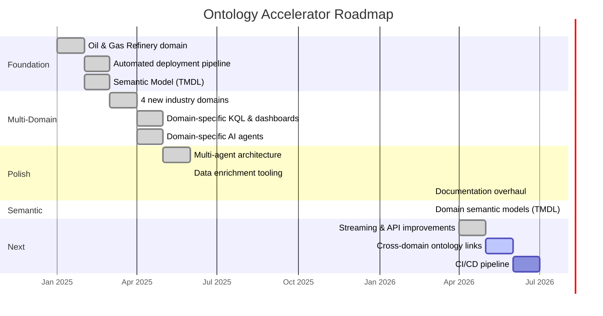

  

  
  

<h1 align="center">📋 Development Plan</h1>

  <b>Sprint roadmap for the Microsoft Fabric IQ Ontology Accelerator</b>

---

## 🗺️ Roadmap Overview

---

## ✅ Completed Sprints

### Sprint 1 — Foundation `Jan–Feb 2025`

| | Task | Status |
|:---:|------|:------:|
| 🛢️ | Oil & Gas Refinery ontology design (13 entities, 17 relationships) | ✅ |
| 📊 | 14 CSV sample data files (410+ rows) | ✅ |
| 🧬 | `Build-Ontology.ps1` — 59-part ontology definition builder | ✅ |
| 🕸️ | 20 GQL graph queries (`RefineryGraphQueries.gql`) | ✅ |
| 📐 | TMDL semantic model (Direct Lake, 13 tables, 17 relationships) | ✅ |
| 📄 | README, SETUP_GUIDE, SEMANTIC_MODEL_GUIDE | ✅ |

### Sprint 2 — Automated Deployment `Feb–Mar 2025`

| | Task | Status |
|:---:|------|:------:|
| 🚀 | `Deploy-OilGasOntology.ps1` — single-command 10-step deployment | ✅ |
| 🗄️ | Lakehouse + PySpark notebook (CSV → Delta) | ✅ |
| 📡 | Eventhouse + KQL Database creation | ✅ |
| 📊 | RTI Dashboard (12 tiles, auto-refresh 30s) | ✅ |
| 🤖 | Data Agent + Operations Agent | ✅ |
| 🔍 | Graph Query Set deployment | ✅ |
| ✅ | `Validate-Deployment.ps1` — post-deploy validation | ✅ |

### Sprint 3 — Multi-Domain Expansion `Mar–Apr 2025`

| | Task | Status |
|:---:|------|:------:|
| 🏢 | Smart Building domain (12 entities, 13 CSVs, 498 rows) | ✅ |
| 🏭 | Manufacturing Plant domain (11 entities, 12 CSVs, 444 rows) | ✅ |
| 🖥️ | IT Asset Management domain (11 entities, 12 CSVs, 381 rows) | ✅ |
| 🌬️ | Wind Turbine domain (12 entities, 13 CSVs, 651 rows) | ✅ |
| 🚀 | `Deploy-Ontology.ps1` — multi-domain entry point with interactive menu | ✅ |
| ⚡ | `Deploy-GenericOntology.ps1` — domain-agnostic deployment engine | ✅ |

### Sprint 4 — Domain-Specific Assets `Apr–May 2025`

| | Task | Status |
|:---:|------|:------:|
| 📡 | Domain-specific KQL tables (5 per domain, 25 total) | ✅ |
| 📊 | Domain-specific RTI dashboards (10-12 tiles per domain, 52 total) | ✅ |
| 🤖 | Domain-specific Data Agents (5 agents with ontology context) | ✅ |
| 🧠 | Domain-specific Operations Agents (5 agents, 25 operational goals) | ✅ |
| 🔄 | Domain-first script resolution (fallback pattern in generic deployer) | ✅ |

### Sprint 5 — Multi-Agent & Polish `May–Jun 2025`

| | Task | Status |
|:---:|------|:------:|
| 🤖 | 7 Copilot agent definitions (`.github/agents/`) | ✅ |
| 📋 | `shared.instructions.md` — hard constraints for all agents | ✅ |
| 📊 | `Enrich-SampleData.ps1` — data enrichment tool (re-runnable) | ✅ |
| 📄 | `AGENTS.md` — multi-agent architecture documentation | ✅ |

### Sprint 6 — Documentation Overhaul `Mar 2026`

| | Task | Status |
|:---:|------|:------:|
| 📄 | README.md — full rewrite with Mermaid diagrams, badges, domain details | ✅ |
| 🔧 | SETUP_GUIDE.md — polished with icons, collapsible sections, troubleshooting | ✅ |
| 📐 | SEMANTIC_MODEL_GUIDE.md — multi-domain coverage with ER diagrams | ✅ |
| 📋 | DEVELOPMENT_PLAN.md — sprint roadmap with Gantt chart | ✅ |
| 🤖 | AGENTS.md — enhanced with Mermaid architecture diagrams | ✅ |

---

### Sprint 7 — Domain Semantic Models `Mar 2026`

| | Task | Status |
|:---:|------|:------:|
| 📐 | Per-domain TMDL semantic models (4 new domains, 70 files) | ✅ |
| 🔗 | `Generate-SemanticModels.ps1` — auto-generate TMDL from CSV schemas | ✅ |
| 📊 | DAX measure templates per domain (100+ measures across 50 tables) | ✅ |
| 🚀 | Semantic model deployment step added to `Deploy-GenericOntology.ps1` | ✅ |

---

### Sprint 7.5 — Consolidation & Multi-Domain Scripts `Mar 2026`

| | Task | Status |
|:---:|------|:------:|
| 📦 | OilGas SemanticModel copied to `ontologies/OilGasRefinery/SemanticModel/` | ✅ |
| ✅ | `Validate-Deployment.ps1` — multi-domain support (5 domains, expected tables) | ✅ |
| 🕸️ | `Deploy-GraphQuerySet.ps1` — multi-domain GQL resolution | ✅ |
| 🧹 | Removed duplicate root `data/`, `deploy/RefineryGraphQueries.gql`, `.bak` files | ✅ |
| 📝 | `.gitignore` — cleaned up with wildcard patterns for temp artifacts | ✅ |
| 🔗 | `Deploy-OilGasOntology.ps1` — updated to use `ontologies/` paths | ✅ |

---

## 🔜 Upcoming Sprints

### Sprint 8 — Streaming & API Improvements `Apr–May 2026`

| | Task | Priority | Status |
|:---:|------|:--------:|:------:|
| 📡 | Eventstream deployment script (Custom App → KQL Database) | 🔴 High | ✅ Done |
| 🔗 | Graph Query Set: push queries via updateDefinition API | 🔴 High | ✅ Done |
| 📊 | KQL Dashboard upgrade to schema v52 (10s min refresh) | 🟡 Medium | ✅ Done |
| 📝 | Remove all "manual step" references from docs and scripts | 🟡 Medium | ✅ Done |
| ⚡ | KQL Database streaming ingestion policies | 🟡 Medium | 🔲 |
| 🔄 | EventHub connector templates | 🟢 Low | 🔲 |

### Sprint 9 — Cross-Domain & Advanced `May–Jun 2026`

| | Task | Priority |
|:---:|------|:--------:|
| 🔗 | Cross-domain ontology linking (e.g., Wind Farm ↔ IT Asset monitoring) | 🟡 Medium |
| 🧬 | Ontology versioning and migration tooling | 🟡 Medium |
| 📋 | Domain templates / scaffolding CLI (new-domain wizard) | 🟡 Medium |
| 🌐 | Multi-language support (entity/property display names) | 🟢 Low |

### Sprint 10 — CI/CD & Enterprise `Jun–Jul 2026`

| | Task | Priority |
|:---:|------|:--------:|
| 🔄 | GitHub Actions CI pipeline (lint, validate, test deployment) | 🔴 High |
| 📦 | Fabric Git integration (workspace ↔ repo sync) | 🔴 High |
| 🏢 | Multi-workspace deployment (dev → staging → prod) | 🟡 Medium |
| 🔐 | Service Principal authentication (headless deployments) | 🟡 Medium |
| 📊 | Deployment telemetry and monitoring dashboard | 🟢 Low |

---

## 📊 Project Statistics

| Metric | Count |
|--------|------:|
| 🏭 Industry domains | 5 |
| 🧬 Entity types (total) | 59 |
| 📊 CSV data files | 64 |
| 📝 Sample data rows | 2,800+ |
| 📡 KQL tables | 25 |
| 📊 Dashboard tiles | 52 |
| 🕸️ GQL queries | 100+ |
| 🤖 AI agents (Data + Ops) | 10 |
| 🤖 Copilot agents | 7 |
| 📄 Documentation files | 5 |
| 📐 TMDL semantic models | 5 |
| ⚡ PowerShell scripts | 30+ |

---

## 🏗️ Architecture Decisions

| # | Decision | Rationale |
|---|----------|-----------|
| ADR-001 | **PowerShell 5.1+** for all scripts | Maximum compatibility across Windows environments |
| ADR-002 | **Deterministic GUIDs** via MD5 hash | Idempotent deployments — re-running creates same IDs |
| ADR-003 | **Domain-first script resolution** | Each domain can override any deploy script; fallback to shared |
| ADR-004 | **TMDL over BIM** for semantic models | Human-readable, diff-friendly, supported by Fabric |
| ADR-005 | **Inline KQL data** for demo tables | No external dependencies; works immediately after deployment |
| ADR-006 | **Per-domain AI instructions** | Each agent has domain-specific entity awareness and thresholds |
| ADR-007 | **Multi-agent Copilot architecture** | Specialized agents provide better assistance per file type |

---

  <a href="README.md">⬅️ Back to README</a> •
  <a href="AGENTS.md">Agents Guide ➡️</a>

