<p align="center">
  
  
  
  
  
</p>

<h1 align="center">:zap: Microsoft Fabric IQ Ontology Accelerator</h1>

<p align="center">
  <b>Deploy production-ready IQ Ontologies across 5 industry domains on Microsoft Fabric --- fully automated, one command.</b>
</p>

<p align="center">
  
  
  
  
  
  
  
  
  
  
</p>

<p align="center">
  <a href="#-quick-start">Quick Start</a> ---
  <a href="#-supported-domains">Domains</a> ---
  <a href="#-what-gets-deployed">What Gets Deployed</a> ---
  <a href="#-architecture">Architecture</a> ---
  <a href="#-multi-agent-development">Agents</a> ---
  <a href="#-development-roadmap">Roadmap</a>
</p>

---
## :globe_with_meridians: Overview

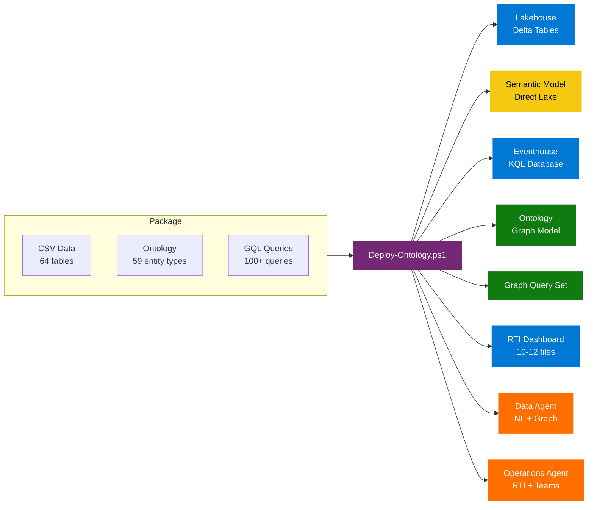

Each domain ships a **complete, ready-to-deploy package**: CSV sample data, ontology definition, graph queries, KQL enrichment tables, a real-time dashboard, and two AI agents --- all wired together and deployed with a single PowerShell command.

---

## :factory: Supported Domains

<table>
<tr>
<td width="20%" align="center">

### :oil_drum: Oil & Gas
**Refinery**
13 entities  14 CSVs
445 rows

</td>
<td width="20%" align="center">

### :office: Smart Building
**Building Ops**
12 entities  13 CSVs
498 rows

</td>
<td width="20%" align="center">

### :factory: Manufacturing
**Plant Floor**
11 entities  12 CSVs
444 rows

</td>
<td width="20%" align="center">

### :desktop_computer: IT Asset
**Infrastructure**
11 entities  12 CSVs
381 rows

</td>
<td width="20%" align="center">

### :wind_face: Wind Turbine
**Wind Farm**
12 entities  13 CSVs
651 rows

</td>
</tr>
<tr>
<td><sub>Refineries, process units, equipment, pipelines, crude oil, sensors, safety alarms</sub></td>
<td><sub>Buildings, floors, zones, HVAC, lighting, elevators, occupancy, energy meters</sub></td>
<td><sub>Plants, production lines, machines, quality checks, materials, batches, OEE</sub></td>
<td><sub>Datacenters, racks, servers, VMs, applications, incidents, licenses</sub></td>
<td><sub>Wind farms, turbines, nacelles, blades, towers, power output, weather stations</sub></td>
</tr>
</table>
---

## :zap: Quick Start

### :dart: One-Command Deployment

```powershell
# Interactive domain menu
.\Deploy-Ontology.ps1 -WorkspaceId "your-workspace-guid"
```

```
  +==============================================================+
  |    Microsoft Fabric IQ Ontology Accelerator                   |
  |    Multi-Domain Deployment                                    |
  +==============================================================+
  |                                                               |
  |    [1]  Oil & Gas Refinery                                    |
  |    [2]  Smart Building                                        |
  |    [3]  Manufacturing Plant                                   |
  |    [4]  IT Asset Management                                   |
  |    [5]  Wind Turbine / Wind Farm                              |
  |                                                               |
  +==============================================================+
```

### :wrench: Direct Domain Selection

```powershell
# Deploy a specific domain
.\Deploy-Ontology.ps1 -WorkspaceId "guid" -OntologyType SmartBuilding
.\Deploy-Ontology.ps1 -WorkspaceId "guid" -OntologyType WindTurbine

# Skip optional components
.\Deploy-Ontology.ps1 -WorkspaceId "guid" -OntologyType ITAsset -SkipDataAgent -SkipDashboard

# Original Oil & Gas (backward compatible)
.\Deploy-OilGasOntology.ps1 -WorkspaceId "your-workspace-guid"
```

> [!TIP]
> **Prerequisites:** PowerShell 5.1+, Az module, Fabric workspace (F2+ capacity). See [SETUP_GUIDE.md](SETUP_GUIDE.md) for detailed instructions.

---

## :gear: What Gets Deployed

Each domain deploys **8 Fabric items** in a coordinated pipeline:

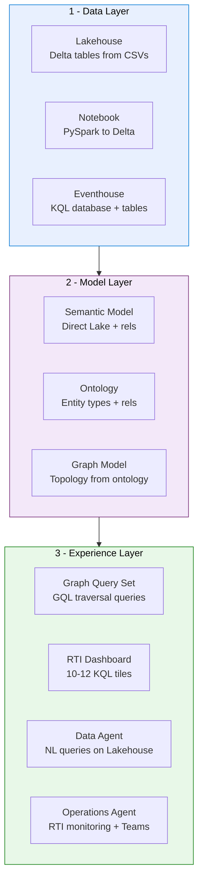

| # | Item | Per Domain | Description |
|---|------|:----------:|-------------|
| :file_cabinet: | **Lakehouse** | 11-14 tables | CSV to Delta via PySpark notebook |
| :triangular_ruler: | **Semantic Model** | 13-17 rels | Direct Lake mode, star/snowflake schema |
| :satellite: | **Eventhouse** | 5 KQL tables | Enriched telemetry + operational metrics |
| :dna: | **Ontology** | 11-13 types | Entity types, properties, relationships |
| :spider_web: | **Graph Model** | auto | Topology derived from ontology |
| :mag: | **Graph Query Set** | 20 queries | GQL traversal patterns |
| :bar_chart: | **RTI Dashboard** | 10-12 tiles | Real-time KQL visualizations |
| :robot: | **AI Agents** | 2 agents | Data Agent + Operations Agent |
---

## :building_construction: Architecture

### :open_file_folder: Project Structure

```
OntologyAccelerator/
|-- README.md                                <-- You are here
|-- SETUP_GUIDE.md                           <-- Step-by-step Fabric setup
|-- SEMANTIC_MODEL_GUIDE.md                  <-- Power BI model configuration
|-- AGENTS.md                                <-- Multi-agent architecture
|-- DEVELOPMENT_PLAN.md                      <-- Sprint roadmap
|-- Enrich-SampleData.ps1                    <-- Data enrichment tool
|
|-- Deploy-Ontology.ps1                      <-- Multi-domain entry point
|-- Deploy-OilGasOntology.ps1                <-- Original single-domain script
|
|-- deploy/                                  <-- Shared deployment engine
|   |-- Deploy-GenericOntology.ps1           <-- Generic deployment orchestrator
|   |-- Build-Ontology.ps1                   <-- Ontology definition builder
|   |-- Build-GraphModel-v2.ps1              <-- Graph model builder
|   |-- Deploy-GraphQuerySet.ps1             <-- GQL query set deployer
|   |-- Deploy-KqlTables.ps1                 <-- KQL table creation (fallback)
|   |-- Deploy-RTIDashboard.ps1              <-- Dashboard deployer (fallback)
|   |-- Deploy-DataAgent.ps1                 <-- Data Agent deployer (fallback)
|   |-- Deploy-OperationsAgent.ps1           <-- Operations Agent deployer (fallback)
|   |-- LoadDataToTables.py                  <-- PySpark notebook template
|   |-- Validate-Deployment.ps1              <-- Post-deploy validation
|   +-- SemanticModel/                       <-- TMDL semantic model (Direct Lake)
|
|-- ontologies/
|   |-- OilGasRefinery/                      <-- Oil & Gas domain
|   |   |-- Build-Ontology.ps1
|   |   |-- GraphQueries.gql
|   |   |-- Deploy-KqlTables.ps1             <-- Domain-specific KQL
|   |   |-- Deploy-RTIDashboard.ps1          <-- Domain-specific dashboard
|   |   |-- Deploy-DataAgent.ps1             <-- Domain-specific AI agent
|   |   |-- Deploy-OperationsAgent.ps1       <-- Domain-specific ops agent
|   |   +-- data/ (14 CSVs)
|   |-- SmartBuilding/                       <-- Smart Building domain  
|   |-- ManufacturingPlant/                  <-- Manufacturing domain
|   |-- ITAsset/                             <-- IT Asset domain
|   +-- WindTurbine/                         <-- Wind Turbine domain
|       +-- (same structure per domain)
|
|-- diagrams/
|   +-- ontology_diagram.md
|
+-- .github/agents/                          <-- 7 Copilot agent definitions
    +-- shared.instructions.md
```

### :arrows_counterclockwise: Domain Script Resolution

The generic deployer uses a **domain-first fallback** pattern:

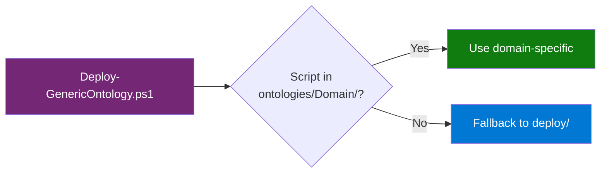
---

## :factory: Domain Details

<details>
<summary><h3>:oil_drum: Oil & Gas Refinery</h3></summary>

**13 entity types** | **17 relationships** | **14 CSVs** | **445 rows**

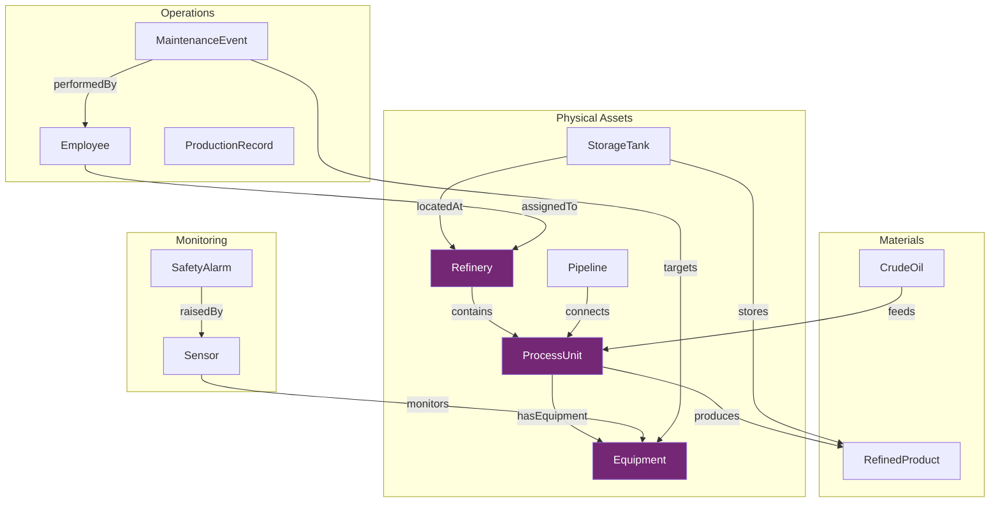

**KQL Tables:** SensorReading | EquipmentAlert | ProcessMetric | PipelineFlow | TankLevel

**Dashboard:** 12 tiles (sensor lines, alert pies, refinery map, throughput, tank levels)

</details>

<details>
<summary><h3>:office: Smart Building</h3></summary>

**12 entity types** | **11 relationships** | **13 CSVs** | **498 rows**

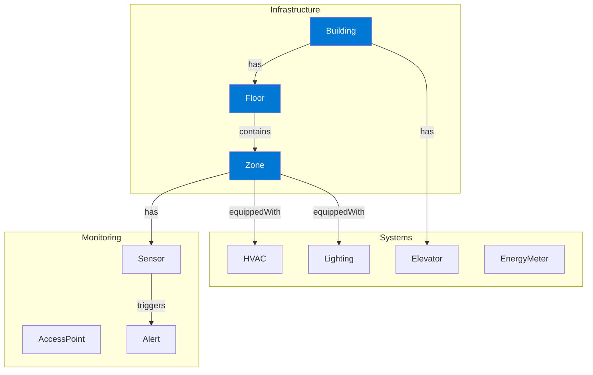

**KQL Tables:** SensorReading | BuildingAlert | HVACMetric | EnergyConsumption | OccupancyMetric

**Dashboard:** 10 tiles (HVAC efficiency, energy cost, zone occupancy, anomalies)

</details>

<details>
<summary><h3>:factory: Manufacturing Plant</h3></summary>

**11 entity types** | **11 relationships** | **12 CSVs** | **444 rows**

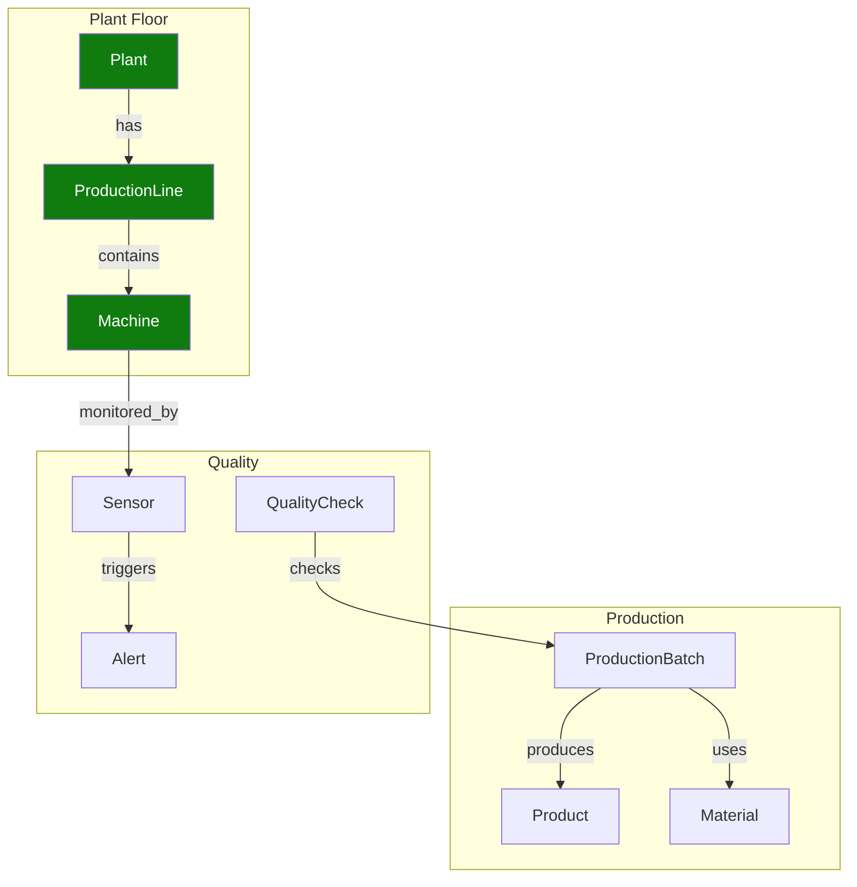

**KQL Tables:** SensorReading | PlantAlert | ProductionMetric | MachineHealth | QualityMetric

**Dashboard:** 10 tiles (OEE bar, machine health, production throughput, defect rate, quality)

</details>

<details>
<summary><h3>:desktop_computer: IT Asset Management</h3></summary>

**11 entity types** | **10 relationships** | **12 CSVs** | **381 rows**

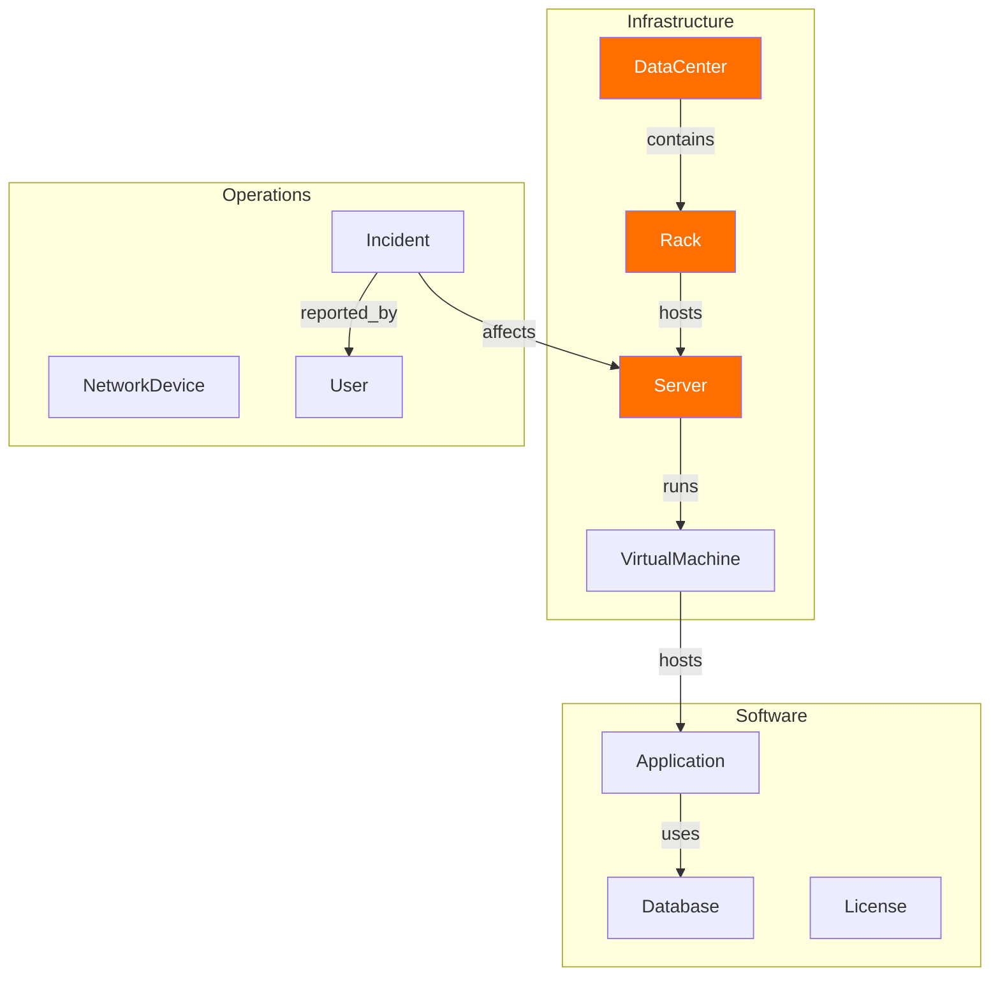

**KQL Tables:** ServerMetric | InfraAlert | ApplicationHealth | NetworkMetric | IncidentMetric

**Dashboard:** 10 tiles (CPU/memory lines, app health, network bandwidth, incident resolution)

</details>

<details>
<summary><h3>:wind_face: Wind Turbine / Wind Farm</h3></summary>

**12 entity types** | **12 relationships** | **13 CSVs** | **651 rows**

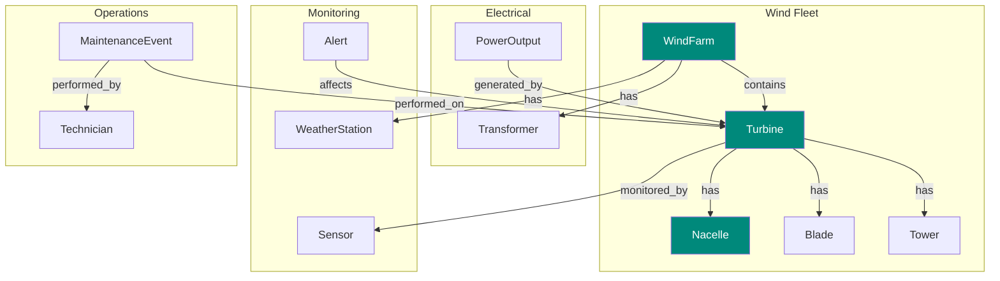

**KQL Tables:** TurbineReading | TurbineAlert | PowerOutputMetric | WeatherMetric | MaintenanceMetric

**Dashboard:** 10 tiles (power output, capacity factor, wind vs power scatter, icing risk, weather)

</details>
---

## :bar_chart: KQL Real-Time Dashboards

<p align="center">
  
  
  
</p>

Each domain deploys its own RTI dashboard with domain-specific KQL queries:

| Domain | Dashboard | Tiles | Key Visuals |
|--------|-----------|:-----:|-------------|
| :oil_drum: Oil & Gas | `RefineryTelemetryDashboard` | 12 | Sensor lines, refinery map, tank levels, alert pies |
| :office: Smart Building | `SmartBuildingDashboard` | 10 | HVAC efficiency, energy cost, zone occupancy |
| :factory: Manufacturing | `ManufacturingDashboard` | 10 | OEE bars, machine health, defect trends |
| :desktop_computer: IT Asset | `ITAssetDashboard` | 10 | CPU/memory lines, app health, incident resolution |
| :wind_face: Wind Turbine | `WindTurbineDashboard` | 10 | Power output, wind-power scatter, icing risk |

---

## :spider_web: Graph Query Set (GQL)

<p align="center">
  
  
</p>

Each domain includes **20 GQL queries** covering:

| Pattern | Example |
|---------|---------|
| :globe_with_meridians: Full topology | `MATCH (n)-[e]->(m) RETURN n, e, m` |
| :mag: Entity drill-down | `MATCH (r:Refinery)-[:contains]->(pu) RETURN r, pu` |
| :link: Multi-hop traversal | Crude to ProcessUnit to Product (3+ hops) |
| :bar_chart: Aggregations | Alert counts by severity, maintenance costs |
| :warning: Anti-patterns | Equipment without recent maintenance |

> [!NOTE]
> Due to a Fabric REST API limitation, GQL queries are deployed as an empty shell. Copy-paste queries from the domain `GraphQueries.gql` file via Fabric UI.

---

## :robot: AI Agents

<p align="center">
  
  
  
</p>

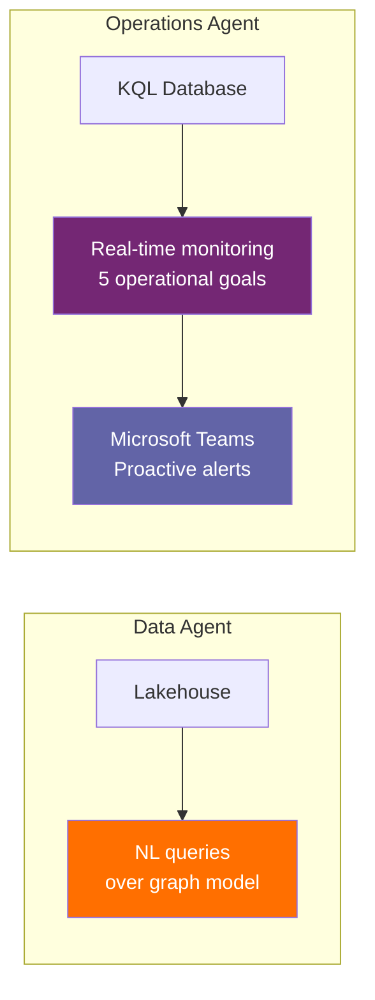

| Domain | Data Agent | Ops Agent | Operational Goals |
|--------|:----------:|:---------:|-------------------|
| :oil_drum: Oil & Gas | :white_check_mark: | :white_check_mark: | Equipment health - Safety - Production - Maintenance - Supply chain |
| :office: Smart Building | :white_check_mark: | :white_check_mark: | HVAC comfort - Energy optimization - Safety - Alerts - Maintenance |
| :factory: Manufacturing | :white_check_mark: | :white_check_mark: | Production efficiency - Machine health - Quality - Safety - Maintenance |
| :desktop_computer: IT Asset | :white_check_mark: | :white_check_mark: | Server health - App performance - Network - Incidents - Capacity |
| :wind_face: Wind Turbine | :white_check_mark: | :white_check_mark: | Turbine performance - Predictive maintenance - Weather - Grid - Fleet |

---

## :robot: Multi-Agent Development

This project uses **7 specialized Copilot agents** for AI-assisted development:

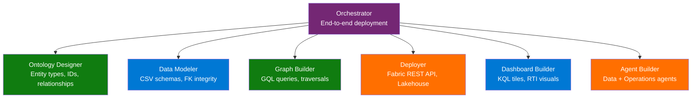

Agents auto-activate based on the file you are editing. See [AGENTS.md](AGENTS.md) for full details.

---

## :shield: Shared Constraints

| Constraint | Detail |
|:----------:|--------|
| :wrench: | **PowerShell 5.1+** --- no `&&`, use `;` for chaining |
| :key: | **Deterministic GUIDs** --- MD5 hash for idempotent deployments |
| :arrows_counterclockwise: | **Fabric REST API** --- 202 polling, 429 retry-after, LRO handling |
| :id: | **ID allocation** --- Entities 1001+, Properties 2001+, Relationships 3001+, Timeseries 4001+ |
| :outbox_tray: | **OneLake DFS** --- PUT resource=file then PATCH append then PATCH flush |

---

## :clipboard: Adding a New Domain

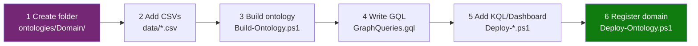

1. Create `ontologies/<DomainName>/` with `data/`, `Build-Ontology.ps1`, `GraphQueries.gql`
2. Add domain-specific: `Deploy-KqlTables.ps1`, `Deploy-RTIDashboard.ps1`, `Deploy-DataAgent.ps1`, `Deploy-OperationsAgent.ps1`
3. Add domain entry to `$domains` hashtable in `Deploy-Ontology.ps1`
4. Run `.\Deploy-Ontology.ps1 -WorkspaceId "guid" -OntologyType <DomainName>`

---

## :books: Documentation

| | Document | Description |
|---|----------|-------------|
| :page_facing_up: | [README.md](README.md) | This overview |
| :wrench: | [SETUP_GUIDE.md](SETUP_GUIDE.md) | Prerequisites, tenant settings, step-by-step setup |
| :triangular_ruler: | [SEMANTIC_MODEL_GUIDE.md](SEMANTIC_MODEL_GUIDE.md) | Power BI semantic model configuration |
| :robot: | [AGENTS.md](AGENTS.md) | Multi-agent architecture and Copilot agent definitions |
| :clipboard: | [DEVELOPMENT_PLAN.md](DEVELOPMENT_PLAN.md) | Sprint roadmap and development plan |

---

## :scroll: License

MIT

---

<p align="center">
  <sub>Built with :heart: for the Microsoft Fabric community</sub>
</p>