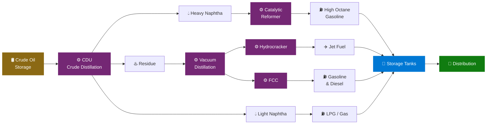

<p align="center">
  
  
  
  
</p>

<h1 align="center">🛢️ Oil & Gas Refinery — Microsoft Fabric IQ Ontology Accelerator</h1>

<p align="center">
  <strong>Deploy a production-ready IQ Ontology for an Oil & Gas Refinery on Microsoft Fabric — fully automated, one command.</strong>
</p>

<p align="center">
  
  
  
  
  
  
</p>

<p align="center">
  <a href="#-quick-start">Quick Start</a> •
  <a href="#ontology-entity-model">Entity Model</a> •
  <a href="#what-gets-deployed">What Gets Deployed</a> •
  <a href="#-kql-real-time-dashboard">Dashboard</a> •
  <a href="#-graph-query-set-gql">Graph Queries</a> •
  <a href="#-operations-agent-real-time-intelligence">Operations Agent</a>
</p>

---

## 🌐 Overview

This accelerator provides a ready-to-use **Microsoft Fabric IQ Ontology (preview)** for an **Oil & Gas Refinery** company. It includes sample data, ontology design documentation, and step-by-step setup instructions to model:

<table>
<tr>
<td width="50%">

### 🏭 Physical Assets
- 🏗️ **Refineries** — geographical locations & capacity
- ⚙️ **Process Units** — CDU, FCC, Hydrocracker, Reformer
- 🔧 **Equipment** — pumps, heat exchangers, compressors
- 🔗 **Pipelines** — connecting process units
- 🛢️ **Storage Tanks** — capacity tracking & levels

</td>
<td width="50%">

### 📊 Operations & Monitoring
- 🛢️ **Crude Oil** — grades, API gravity, sulfur content
- ⛽ **Refined Products** — gasoline, diesel, jet fuel, LPG
- 📡 **Sensors / IoT** — real-time telemetry on equipment
- 🔨 **Maintenance Events** — asset management & scheduling
- 🚨 **Safety Alarms** — incident tracking & severity
- 👷 **Employees** — operators & shift assignments

</td>
</tr>
</table>

---

## 🧬 Ontology Entity Model

<details>
<summary><b>📋 Entity Types</b> (click to expand)</summary>
<br/>

| | Entity Type | Key Property | Description |
|---|---|---|---|
| 🏗️ | **Refinery** | `RefineryId` | Oil refinery facility with location and capacity info |
| ⚙️ | **ProcessUnit** | `ProcessUnitId` | Major refinery process unit (CDU, FCC, etc.) |
| 🔧 | **Equipment** | `EquipmentId` | Individual equipment item (pump, compressor, etc.) |
| 🔗 | **Pipeline** | `PipelineId` | Pipeline segment connecting process units |
| 🛢️ | **CrudeOil** | `CrudeOilId` | Crude oil grade/type with API gravity and sulfur content |
| ⛽ | **RefinedProduct** | `ProductId` | Output product (gasoline, diesel, kerosene, etc.) |
| 🫙 | **StorageTank** | `TankId` | Storage tank with capacity and current level |
| 📡 | **Sensor** | `SensorId` | IoT sensor measuring temperature, pressure, flow, etc. |
| 🔨 | **MaintenanceEvent** | `MaintenanceId` | Scheduled or unscheduled maintenance activity |
| 🚨 | **SafetyAlarm** | `AlarmId` | Safety or operational alarm event |
| 👷 | **Employee** | `EmployeeId` | Refinery employee/operator |

</details>

<details>
<summary><b>🔀 Relationship Types</b> (click to expand)</summary>
<br/>

| | Relationship | From → To | Cardinality | Description |
|---|---|---|---|---|
| 🏗️→⚙️ | **contains** | Refinery → ProcessUnit | `1:N` | A refinery contains multiple process units |
| ⚙️→🔧 | **hasEquipment** | ProcessUnit → Equipment | `1:N` | A process unit contains equipment |
| 🛢️→⚙️ | **feeds** | CrudeOil → ProcessUnit | `N:N` | Crude oil grades feed into process units |
| ⚙️→⛽ | **produces** | ProcessUnit → RefinedProduct | `N:N` | Process units produce refined products |
| 🔗→⚙️ | **connectsFrom** | Pipeline → ProcessUnit | `N:1` | Pipeline connects from a process unit |
| 🔗→⚙️ | **connectsTo** | Pipeline → ProcessUnit | `N:1` | Pipeline connects to a process unit |
| 🫙→⛽ | **stores** | StorageTank → RefinedProduct | `N:1` | Tank stores a specific product |
| 🫙→🏗️ | **locatedAt** | StorageTank → Refinery | `N:1` | Tank is located at a refinery |
| 📡→🔧 | **monitors** | Sensor → Equipment | `N:1` | Sensor monitors a piece of equipment |
| 🔨→🔧 | **targets** | MaintenanceEvent → Equipment | `N:1` | Maintenance event targets equipment |
| 🔨→👷 | **performedBy** | MaintenanceEvent → Employee | `N:1` | Maintenance performed by an employee |
| 🚨→📡 | **raisedBy** | SafetyAlarm → Sensor | `N:1` | Alarm raised by a sensor reading |
| 👷→🏗️ | **assignedTo** | Employee → Refinery | `N:1` | Employee assigned to a refinery |

</details>

---

## 📂 Files Structure

<details>
<summary><b>🗂️ Full project tree</b> (click to expand)</summary>

```
OntologyAccelerator/
├── 📄 README.md                              # This file
├── 📄 SETUP_GUIDE.md                         # Step-by-step Fabric setup instructions
├── 📄 SEMANTIC_MODEL_GUIDE.md                # Power BI semantic model configuration
├── 🚀 Deploy-OilGasOntology.ps1              # Main automated deployment script (Steps 0-10)
├── 📊 data/
│   ├── DimRefinery.csv                       # 🏗️ Refinery dimension data
│   ├── DimProcessUnit.csv                    # ⚙️ Process unit dimension data
│   ├── DimEquipment.csv                      # 🔧 Equipment dimension data
│   ├── DimPipeline.csv                       # 🔗 Pipeline dimension data
│   ├── DimCrudeOil.csv                       # 🛢️ Crude oil grades dimension data
│   ├── DimRefinedProduct.csv                 # ⛽ Refined products dimension data
│   ├── DimStorageTank.csv                    # 🫙 Storage tanks dimension data
│   ├── DimSensor.csv                         # 📡 Sensor dimension data
│   ├── DimEmployee.csv                       # 👷 Employee dimension data
│   ├── FactMaintenance.csv                   # 🔨 Maintenance events fact data
│   ├── FactSafetyAlarm.csv                   # 🚨 Safety alarm fact data
│   ├── FactProduction.csv                    # 📈 Daily production output fact data
│   ├── BridgeCrudeOilProcessUnit.csv         # 🔀 Crude oil to process unit mapping
│   └── SensorTelemetry.csv                   # 📡 Streaming telemetry (for Eventhouse)
├── ⚡ deploy/
│   ├── Build-Ontology.ps1                    # 🧬 Ontology definition builder (59 parts)
│   ├── Build-GraphModel-v2.ps1               # 🕸️ Graph model builder
│   ├── Deploy-RTIDashboard.ps1               # 📊 KQL Real-Time Dashboard (12 tiles)
│   ├── Deploy-DataAgent.ps1                  # 🤖 Fabric Data Agent (requires F64+)
│   ├── Deploy-OperationsAgent.ps1            # 🧠 Operations Agent (RTI, Teams)
│   ├── Deploy-GraphQuerySet.ps1              # 🔍 Graph Query Set item creator
│   ├── Deploy-KqlTables.ps1                  # 🗄️ KQL table creation and data ingestion
│   ├── LoadDataToTables.py                   # 🐍 PySpark notebook for CSV → Delta tables
│   ├── RefineryGraphQueries.gql              # 📝 GQL query reference file
│   ├── Validate-Deployment.ps1               # ✅ Post-deployment validation
│   ├── SemanticModel.bim                     # 📦 Legacy BIM definition
│   └── SemanticModel/                        # 📐 TMDL semantic model definition
│       ├── definition.pbism                  # Semantic model binding
│       └── definition/                       # Table & relationship TMDL files
└── 🖼️ diagrams/
    └── ontology_diagram.md                   # Visual representation of the ontology
```

</details>

---

## ⚡ Quick Start

### 🅰️ Automated Deployment (Recommended)

```powershell
# That's it. One command.
cd OntologyAccelerator
.\Deploy-OilGasOntology.ps1 -WorkspaceId "your-workspace-guid"
```

> [!TIP]
> **Prerequisites:** PowerShell 5.1+, Az module, Fabric workspace. The script automates all 10 steps — see [SETUP_GUIDE.md](SETUP_GUIDE.md#automated-deployment).

### 🅱️ Manual Setup

<details>
<summary><b>📝 Step-by-step manual deployment</b> (click to expand)</summary>
<br/>

| Step | Action | Guide |
|:---:|--------|-------|
| 1️⃣ | **Enable prerequisites** — Tenant settings & capacity | [SETUP_GUIDE.md](SETUP_GUIDE.md) |
| 2️⃣ | **Upload data** — Load CSV files into a Fabric Lakehouse | `data/` folder |
| 3️⃣ | **Create semantic model** — Direct Lake model | [SEMANTIC_MODEL_GUIDE.md](SEMANTIC_MODEL_GUIDE.md) |
| 4️⃣ | **Generate ontology** — Build from semantic model | Fabric IQ UI |
| 5️⃣ | **Set up Eventhouse** — Upload `SensorTelemetry.csv` | Fabric Eventhouse |
| 6️⃣ | **RTI Dashboard** — Open & configure dashboard | Fabric Dashboard |
| 7️⃣ | **Graph Query Set** — Run GQL queries | Fabric GQS UI |

</details>

### 🎯 What Gets Deployed

| | Item | Type | Description |
|---|------|------|-------------|
| 🗄️ | `OilGasRefineryLH` | **Lakehouse** | 13 Delta tables with refinery data |
| 📓 | `OilGasRefinery_LoadTables` | **Notebook** | PySpark notebook for CSV → Delta table loading |
| 📡 | `RefineryTelemetryEH` | **Eventhouse** | Real-time telemetry with 5 KQL tables (auto-populated) |
| 📊 | `OilGasRefinerySM` | **Semantic Model** | Direct Lake model (13 tables, 17 relationships) |
| 🧬 | `OilGasRefineryOntology` | **Ontology** | 59-part ontology definition |
| 🕸️ | `OilGasRefineryOntology_graph_*` | **GraphModel** | Graph model with full query readiness |
| 📈 | `RefineryTelemetryDashboard` | **KQL Dashboard** | 12 real-time visualization tiles |
| 🔍 | `OilGasRefineryQueries` | **Graph Query Set** | Empty shell (add GQL queries manually via UI) |
| 🤖 | `OilGasRefineryAgent` | **Data Agent** | Ontology-powered NL query agent (requires F64+) |
| 🧠 | `RefineryOperationsAgent` | **Operations Agent** | AI agent monitoring KQL telemetry → Teams |

---

## 🏭 Domain Context

### 🔄 Refinery Process Flow



### 📏 Key Metrics Tracked

<table>
<tr>
<td width="50%">

| | Metric | Details |
|---|--------|--------|
| 📦 | **Throughput** | Barrels per day |
| 📊 | **Yield** | Product output vs. crude input |
| ⏱️ | **Equipment uptime** | Uptime / downtime tracking |
| 🌡️ | **Sensor readings** | Temperature, pressure, flow, vibration |

</td>
<td width="50%">

| | Metric | Details |
|---|--------|--------|
| 🔨 | **Maintenance** | Frequency and cost |
| 🚨 | **Safety alarms** | Frequency and severity |
| 🫙 | **Tank utilization** | Current level vs. capacity |

</td>
</tr>
</table>

---

## 📊 KQL Real-Time Dashboard

<p align="center">
  
  
  
</p>

The `RefineryTelemetryDashboard` provides **12 visualization tiles** across **5 KQL tables**:

<details>
<summary><b>🖥️ All dashboard tiles</b> (click to expand)</summary>
<br/>

| | Tile | Visual | Data Source |
|---|------|--------|-------------|
| 📈 | Sensor Readings Over Time | Line chart | `SensorReading` |
| 🥧 | Equipment Alerts by Severity | Pie chart | `EquipmentAlert` |
| 📈 | Alert Trend Over Time | Line chart | `EquipmentAlert` |
| 🗺️ | Refinery Locations | Map | Inline coordinates |
| 📋 | Top Sensors by Reading Count | Table | `SensorReading` |
| 🔎 | Anomaly Detections | Table | `SensorReading` |
| 📈 | Process Unit Throughput | Line chart | `ProcessMetric` |
| 📋 | Pipeline Flow Status | Table | `PipelineFlow` |
| 📋 | Current Tank Levels | Table | `TankLevel` |
| ⚠️ | Unacknowledged Alerts | Table | `EquipmentAlert` |
| 🥧 | Sensor Quality Distribution | Pie chart | `SensorReading` |
| 📈 | Tank Level Trend | Line chart | `TankLevel` |

</details>

---

## 🕸️ Graph Query Set (GQL)

<p align="center">
  
  
</p>

The `OilGasRefineryQueries` Graph Query Set is created as an empty shell. Due to a Fabric REST API limitation, queries must be added manually via the UI.

> [!NOTE]
> **To add queries:** Open the GQS in Fabric → select the ontology graph model → copy-paste from [deploy/RefineryGraphQueries.gql](deploy/RefineryGraphQueries.gql).

<details>
<summary><b>🔍 All 20 GQL queries</b> (click to expand)</summary>
<br/>

| # | | Query | Pattern |
|---|---|-------|--------|
| 1 | 🌐 | Full Refinery Topology | `MATCH (n)-[e]->(m) RETURN n, e, m` |
| 2 | 🏗️ | Process Units & Equipment | `Refinery → ProcessUnit → Equipment` |
| 3 | 📡 | Sensors & Alarms | `Equipment → Sensor ← SafetyAlarm` |
| 4 | 🔨 | Maintenance Events | `Employee ← MaintenanceEvent → Equipment` |
| 5 | 🛢️ | Crude Supply Chain | `CrudeOil ← CrudeOilFeed → ProcessUnit` |
| 6 | ⛽ | Production Records | `ProcessUnit ← ProductionRecord → RefinedProduct` |
| 7 | 🫙 | Storage Tanks | `Refinery → StorageTank → RefinedProduct` |
| 8 | 🔗 | Pipeline Network | `Refinery → Pipeline → ProcessUnit` |
| 9 | 🔄 | End-to-End | `CrudeOil → ... → RefinedProduct` |
| 10 | 👷 | Workforce | `Refinery → Employee ← MaintenanceEvent` |
| 11 | 📡 | Sensors on Specific Equipment | Filter by `EquipmentId` |
| 12 | 🚨 | Unresolved Safety Alarms | `SafetyAlarm WHERE Status = 'Active'` |
| 13 | ⚠️ | Equipment Without Maintenance | Anti-pattern detection |
| 14 | 🚨 | High-Severity Alarms by Refinery | Aggregated alarm analysis |
| 15 | 🔗 | Pipeline Connections Between Units | `ProcessUnit → Pipeline → ProcessUnit` |
| 16 | ⛽ | Products Stored per Refinery | `Refinery → StorageTank → RefinedProduct` |
| 17 | 👷 | Employee Maintenance Workload | Workload distribution |
| 18 | 🛢️ | Crude Oil API Gravity Analysis | Property-based filtering |
| 19 | 🔄 | Multi-Hop: Crude to Final Product | Full value chain traversal |
| 20 | 🏗️ | Refinery Equipment Health Summary | Equipment status overview |

</details>

---

## 🧠 Operations Agent (Real-Time Intelligence)

<p align="center">
  
  
  
</p>

The `RefineryOperationsAgent` is a Fabric Operations Agent that continuously monitors KQL Database telemetry and sends actionable recommendations via Microsoft Teams.

<table>
<tr>
<td width="50%">

### 📡 What It Monitors
- 🌡️ Equipment sensor anomalies (temperature, pressure, flow, vibration)
- 🚨 Critical/High severity safety alarms & unacknowledged alerts
- 📉 Production throughput drops & yield degradation
- 💰 Maintenance costs, recurring failures, overdue inspections

</td>
<td width="50%">

### ✅ Prerequisites
-  capacity (Trial may work for creation)
- 🔑 Tenant admin: enable *Operations Agent* + *Copilot & Azure OpenAI*
-  with *Fabric Operations Agent* app

</td>
</tr>
</table>

### 🚀 Post-Deployment Setup (Fabric UI)

| Step | Action |
|:---:|--------|
| 1️⃣ | Open the agent → Add **Knowledge Source** → Select `RefineryTelemetryEH` / `RefineryTelemetryDB` |
| 2️⃣ | Configure **Actions** *(optional)*: Power Automate flows for alerts, work orders, escalations |
| 3️⃣ | **Save** to generate the playbook → **Start** the agent |
| 4️⃣ | Recipients receive proactive recommendations in Teams chat 💬 |
