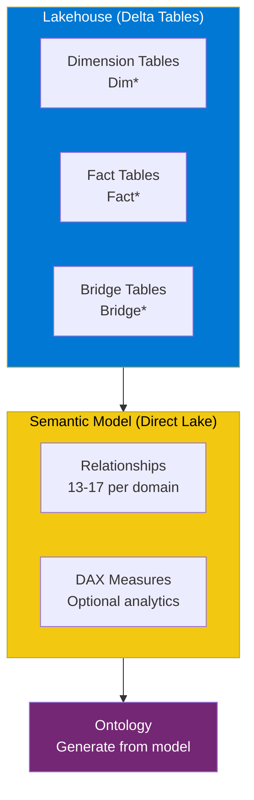
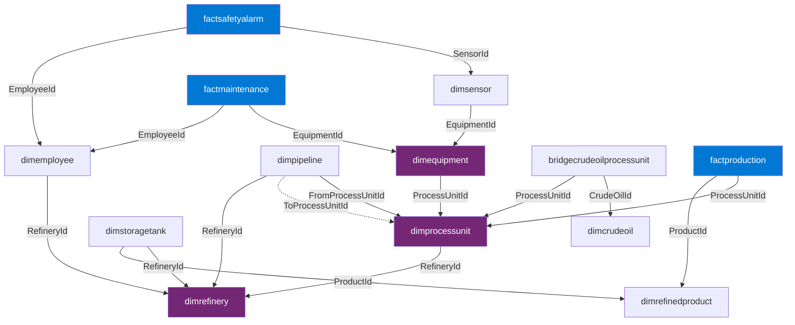

<p align="center">
  
</p>

<p align="center">
  
  
  
</p>

<h1 align="center">:triangular_ruler: Semantic Model Guide</h1>

<p align="center">
  <b>Power BI semantic model configuration for all 6 ontology domains</b>
</p>

> [!TIP]
> **Automated Deployment:** If you used `Deploy-Ontology.ps1`, the semantic model is already created in **TMDL format** (Direct Lake mode) and you can skip this manual guide. The model definition files are in `deploy/SemanticModel/`.

---

## :globe_with_meridians: Overview

Each domain creates a **Direct Lake** semantic model that connects directly to the Lakehouse delta tables. The model follows a **star/snowflake schema** with dimension and fact tables.



---

## :oil_drum: Oil & Gas Refinery Model

<details open>
<summary><h3>Step 1 - Create the Semantic Model</h3></summary>

1. Open the `OilGasRefineryLH` lakehouse
2. From the ribbon, select **New semantic model**
3. Configure:
   - **Name**: `OilGasRefineryModel`
   - **Workspace**: Your workspace
4. Select **all 13 tables** and click **Confirm**

</details>

<details>
<summary><h3>Step 2 - Define Relationships (17 total)</h3></summary>

Open the model in **Editing mode** > **Manage relationships** > **+ New relationship**

#### :building_construction: Core Asset Hierarchy

| From Table | From Column | To Table | To Column | Cardinality |
|---|---|---|---|---|
| `dimprocessunit` | `RefineryId` | `dimrefinery` | `RefineryId` | *:1 |
| `dimequipment` | `ProcessUnitId` | `dimprocessunit` | `ProcessUnitId` | *:1 |

#### :link: Pipeline Connections

| From Table | From Column | To Table | To Column | Cardinality | Active |
|---|---|---|---|---|:---:|
| `dimpipeline` | `FromProcessUnitId` | `dimprocessunit` | `ProcessUnitId` | *:1 | :white_check_mark: |
| `dimpipeline` | `ToProcessUnitId` | `dimprocessunit` | `ProcessUnitId` | *:1 | :x: (inactive) |
| `dimpipeline` | `RefineryId` | `dimrefinery` | `RefineryId` | *:1 | :white_check_mark: |

> :bulb: Two relationships from `dimpipeline` reference `dimprocessunit`. Only one can be active. Use DAX `USERELATIONSHIP()` for the inactive one.

#### :file_cabinet: Storage

| From Table | From Column | To Table | To Column | Cardinality |
|---|---|---|---|---|
| `dimstoragetank` | `RefineryId` | `dimrefinery` | `RefineryId` | *:1 |
| `dimstoragetank` | `ProductId` | `dimrefinedproduct` | `ProductId` | *:1 |

#### :satellite: Monitoring

| From Table | From Column | To Table | To Column | Cardinality |
|---|---|---|---|---|
| `dimsensor` | `EquipmentId` | `dimequipment` | `EquipmentId` | *:1 |

#### :wrench: Maintenance

| From Table | From Column | To Table | To Column | Cardinality |
|---|---|---|---|---|
| `factmaintenance` | `EquipmentId` | `dimequipment` | `EquipmentId` | *:1 |
| `factmaintenance` | `PerformedByEmployeeId` | `dimemployee` | `EmployeeId` | *:1 |

#### :rotating_light: Safety

| From Table | From Column | To Table | To Column | Cardinality |
|---|---|---|---|---|
| `factsafetyalarm` | `SensorId` | `dimsensor` | `SensorId` | *:1 |
| `factsafetyalarm` | `AcknowledgedByEmployeeId` | `dimemployee` | `EmployeeId` | *:1 |

#### :chart_with_upwards_trend: Production

| From Table | From Column | To Table | To Column | Cardinality |
|---|---|---|---|---|
| `factproduction` | `ProcessUnitId` | `dimprocessunit` | `ProcessUnitId` | *:1 |
| `factproduction` | `ProductId` | `dimrefinedproduct` | `ProductId` | *:1 |

#### :bust_in_silhouette: Employee & Bridge

| From Table | From Column | To Table | To Column | Cardinality |
|---|---|---|---|---|
| `dimemployee` | `RefineryId` | `dimrefinery` | `RefineryId` | *:1 |
| `bridgecrudeoilprocessunit` | `CrudeOilId` | `dimcrudeoil` | `CrudeOilId` | *:1 |
| `bridgecrudeoilprocessunit` | `ProcessUnitId` | `dimprocessunit` | `ProcessUnitId` | *:1 |

</details>

<details>
<summary><h3>Step 3 - Relationship Diagram</h3></summary>



</details>

<details>
<summary><h3>Step 4 - Suggested DAX Measures (Optional)</h3></summary>

```dax
// Total Refining Capacity
Total Refining Capacity = SUM(dimrefinery[CapacityBPD])

// Total Production Output
Total Production = SUM(factproduction[OutputBarrels])

// Average Yield
Avg Yield Pct = AVERAGE(factproduction[YieldPercent])

// Total Maintenance Cost
Total Maintenance Cost = SUM(factmaintenance[CostUSD])

// Critical Alarm Count
Critical Alarms = 
    CALCULATE(COUNTROWS(factsafetyalarm), factsafetyalarm[Severity] = "Critical")

// Tank Utilization
Avg Tank Utilization = 
    DIVIDE(SUM(dimstoragetank[CurrentLevelBarrels]), SUM(dimstoragetank[CapacityBarrels]), 0)

// Equipment Availability
Equipment Availability = 
    DIVIDE(
        CALCULATE(COUNTROWS(dimequipment), dimequipment[Status] = "Active"),
        COUNTROWS(dimequipment), 0)
```

</details>

---

## :office: Smart Building Model

<details>
<summary><h3>Entity-Relationship Overview</h3></summary>

**12 entity types** | **~15 relationships** | **Star schema**

Key relationships:
- `dimfloor.BuildingId` :arrow_right: `dimbuilding.BuildingId`
- `dimzone.FloorId` :arrow_right: `dimfloor.FloorId`
- `dimsensor.ZoneId` :arrow_right: `dimzone.ZoneId`
- `dimhvacsystem.ZoneId` :arrow_right: `dimzone.ZoneId`
- `factalert.SensorId` :arrow_right: `dimsensor.SensorId`
- `factmaintenanceticket.ZoneId` :arrow_right: `dimzone.ZoneId`

</details>

## :factory: Manufacturing Plant Model

<details>
<summary><h3>Entity-Relationship Overview</h3></summary>

**11 entity types** | **~13 relationships** | **Star schema**

Key relationships:
- `dimproductionline.PlantId` :arrow_right: `dimplant.PlantId`
- `dimmachine.LineId` :arrow_right: `dimproductionline.LineId`
- `dimsensor.MachineId` :arrow_right: `dimmachine.MachineId`
- `factproductionbatch.ProductId` :arrow_right: `dimproduct.ProductId`
- `factqualitycheck.BatchId` :arrow_right: `factproductionbatch.BatchId`

</details>

## :desktop_computer: IT Asset Model

<details>
<summary><h3>Entity-Relationship Overview</h3></summary>

**11 entity types** | **~12 relationships** | **Star schema**

Key relationships:
- `dimrack.DataCenterId` :arrow_right: `dimdatacenter.DataCenterId`
- `dimserver.RackId` :arrow_right: `dimrack.RackId`
- `dimvirtualmachine.ServerId` :arrow_right: `dimserver.ServerId`
- `dimapplication.VMId` :arrow_right: `dimvirtualmachine.VMId`
- `factincident.ServerId` :arrow_right: `dimserver.ServerId`

</details>

## :wind_face: Wind Turbine Model

<details>
<summary><h3>Entity-Relationship Overview</h3></summary>

**12 entity types** | **~14 relationships** | **Star schema**

Key relationships:
- `dimturbine.FarmId` :arrow_right: `dimwindfarm.FarmId`
- `dimnacelle.TurbineId` :arrow_right: `dimturbine.TurbineId`
- `dimblade.TurbineId` :arrow_right: `dimturbine.TurbineId`
- `dimtower.TurbineId` :arrow_right: `dimturbine.TurbineId`
- `dimsensor.TurbineId` :arrow_right: `dimturbine.TurbineId`
- `factpoweroutput.TurbineId` :arrow_right: `dimturbine.TurbineId`
- `factmaintenanceevent.TurbineId` :arrow_right: `dimturbine.TurbineId`

</details>

---

## :hospital: Healthcare Model

<details>
<summary><h3>Entity-Relationship Overview</h3></summary>

**9 entity types** | **17 relationships** | **Snowflake schema**

Key relationships:
- `dimdepartment.HospitalId` :arrow_right: `dimhospital.HospitalId`
- `dimward.DepartmentId` :arrow_right: `dimdepartment.DepartmentId`
- `dimphysician.DepartmentId` :arrow_right: `dimdepartment.DepartmentId`
- `dimnurse.WardId` :arrow_right: `dimward.WardId`
- `dimpatient.WardId` :arrow_right: `dimward.WardId`
- `dimmedicaldevice.WardId` :arrow_right: `dimward.WardId`
- `dimsensor.DeviceId` :arrow_right: `dimmedicaldevice.DeviceId`
- `factlabresult.PatientId` :arrow_right: `dimpatient.PatientId`
- `factlabresult.PhysicianId` :arrow_right: `dimphysician.PhysicianId`
- `factprocedure.PatientId` :arrow_right: `dimpatient.PatientId`
- `factprocedure.PhysicianId` :arrow_right: `dimphysician.PhysicianId`
- `factmedicationadmin.PatientId` :arrow_right: `dimpatient.PatientId`
- `factmedicationadmin.MedicationId` :arrow_right: `dimmedication.MedicationId`
- `factmedicationadmin.NurseId` :arrow_right: `dimnurse.NurseId`
- `bridgewarddevice.WardId` :arrow_right: `dimward.WardId`
- `bridgewarddevice.DeviceId` :arrow_right: `dimmedicaldevice.DeviceId`
- `sensortelemetry.SensorId` :arrow_right: `dimsensor.SensorId`

</details>

---

## :white_check_mark: Verify and Publish

1. **Verify** all relationships show green checkmarks in the model diagram
2. **Test** by creating a quick visual:
   - Bar chart: primary dimension key vs a fact table measure
   - This validates the relationship chain works end-to-end
3. **Publish** (if using Power BI Desktop) or save (if editing in service)

---

<p align="center">
  <a href="SETUP_GUIDE.md">:arrow_left: Setup Guide</a> ---
  <a href="AGENTS.md">Agents Guide :arrow_right:</a>
</p>