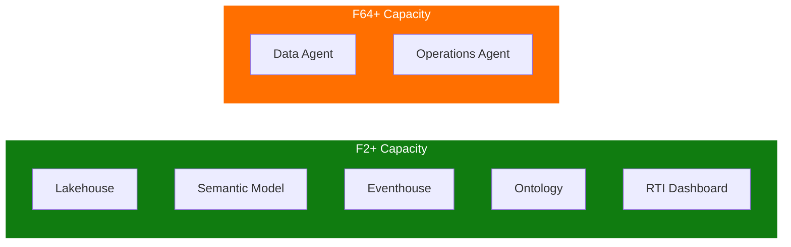
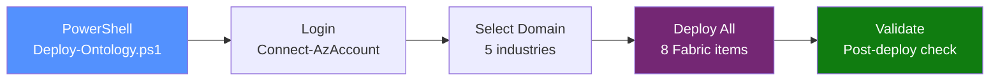
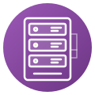

<p align="center">
  
</p>

<p align="center">
  
  
</p>

<h1 align="center">:wrench: Setup Guide</h1>

<p align="center">
  <b>Step-by-step instructions for deploying the IQ Ontology Accelerator on Microsoft Fabric</b>
</p>

<p align="center">
  <a href="#-prerequisites">Prerequisites</a> ---
  <a href="#-automated-deployment">Automated</a> ---
  <a href="#-manual-setup">Manual</a> ---
  <a href="#-troubleshooting">Troubleshooting</a>
</p>

---

## :clipboard: Prerequisites

### 1 - Fabric Capacity

| Requirement | Detail |
|:----------:|--------|
| :zap: | **Fabric capacity** F2 or higher (Trial may work for basic items) |
| :globe_with_meridians: | A Fabric **workspace** assigned to the capacity |
| :key: | **Az PowerShell module** installed (`Install-Module Az -Scope CurrentUser`) |

### 2 - Tenant Settings

> [!IMPORTANT]
> A Fabric administrator must enable these settings in **Admin Portal > Tenant settings**:

| | Setting | Required |
|:---:|---------|:--------:|
| :dna: | **Enable Ontology item (preview)** | :white_check_mark: Required |
| :spider_web: | **User can create Graph (preview)** | :white_check_mark: Required |
| :bar_chart: | **Create Real-Time dashboards** | :white_check_mark: Required |
| :robot: | **Users can create and share Data agent item types (preview)** | :large_orange_diamond: Recommended |
| :brain: | **Users can use Copilot and other features powered by Azure OpenAI** | :large_orange_diamond: Recommended |
| :globe_with_meridians: | **Data sent to Azure OpenAI can be processed outside your capacity's geographic region** | :large_orange_diamond: Recommended |

### 3 - Capacity Requirements by Feature



> [!NOTE]
> **Data Agents** and **Operations Agents** require Fabric capacity **F64 or higher**. Use `-SkipDataAgent` and `-SkipOperationsAgent` flags on lower SKUs.

---

## :rocket: Automated Deployment

The fastest way to deploy any domain --- a single command creates all Fabric items:



### Step 1 - Connect to Azure

```powershell
# Login to Azure (required for Fabric REST API access)
Connect-AzAccount
```

### Step 2 - Find your Workspace ID

```powershell
# Option A: From the Fabric portal URL
# https://app.fabric.microsoft.com/groups/<WorkspaceId>/...

# Option B: Via REST API
$token = (Get-AzAccessToken -ResourceUrl "https://api.fabric.microsoft.com").Token
$headers = @{ "Authorization" = "Bearer $token" }
(Invoke-RestMethod -Uri "https://api.fabric.microsoft.com/v1/workspaces" -Headers $headers).value | Format-Table displayName, id
```

### Step 3 - Deploy

```powershell
# Interactive menu (choose domain at runtime)
.\Deploy-Ontology.ps1 -WorkspaceId "your-workspace-guid"

# Direct deployment (skip the menu)
.\Deploy-Ontology.ps1 -WorkspaceId "guid" -OntologyType OilGasRefinery
.\Deploy-Ontology.ps1 -WorkspaceId "guid" -OntologyType SmartBuilding
.\Deploy-Ontology.ps1 -WorkspaceId "guid" -OntologyType ManufacturingPlant
.\Deploy-Ontology.ps1 -WorkspaceId "guid" -OntologyType ITAsset
.\Deploy-Ontology.ps1 -WorkspaceId "guid" -OntologyType WindTurbine

# Skip optional components (useful for lower-SKU capacity)
.\Deploy-Ontology.ps1 -WorkspaceId "guid" -OntologyType ITAsset -SkipDataAgent -SkipDashboard -SkipOperationsAgent
```

### Step 4 - Validate

```powershell
# Run post-deployment validation
.\deploy\Validate-Deployment.ps1 -WorkspaceId "your-workspace-guid"
```

### What Gets Created

| Step | Action | Time |
|:----:|--------|:----:|
| 0 | :file_cabinet: Create Lakehouse | ~30s |
| 1 | :notebook: Upload PySpark notebook | ~20s |
| 2 | :arrow_up: Upload CSV files to OneLake | ~60s |
| 3 | :play_button: Execute notebook (CSV to Delta) | ~3min |
| 4 | :triangular_ruler: Create Semantic Model (Direct Lake + TMDL) | ~30s |
| 5 | :dna: Create Ontology (entity types + relationships) | ~45s |
| 6 | :spider_web: Build Graph Model | ~30s |
| 7 | :satellite: Create Eventhouse + KQL Database + Tables | ~2min |
| 8 | :mag: Create Graph Query Set | ~15s |
| 9 | :bar_chart: Create RTI Dashboard (10-12 tiles) | ~30s |
| 10 | :robot: Create Data Agent + Operations Agent | ~45s |

> **Total estimated time:** ~8-10 minutes per domain

---

## :hammer_and_wrench: Manual Setup

If you prefer to create items manually (or as a learning exercise), follow the steps below. These instructions use the **Oil & Gas Refinery** domain as an example. The same pattern applies to all domains.

<details>
<summary><h3>Step 1 - Create the Lakehouse</h3></summary>

1. Navigate to your Fabric workspace
2. Select **+ New item** > **Lakehouse**
3. Name it: `OilGasRefineryLH` (or `<DomainName>LH`)
4. Click **Create**

</details>

<details>
<summary><h3>Step 2 - Upload Data Files</h3></summary>

1. In the lakehouse, select **Get data** > **Upload files**
2. Upload all CSV files from the domain `data/` folder
3. After uploading, **load each file to a delta table**:
   - Expand **Files** in the Explorer
   - For each file: Right-click > **Load to Tables** > **New table**
   - Keep default table names (lowercase versions of filenames)

**Domain CSV files:**

| Domain | CSV Count | Key Tables |
|--------|:---------:|------------|
|  Oil & Gas | 14 | DimRefinery, DimEquipment, DimSensor, FactProduction, SensorTelemetry |
|  Smart Building | 13 | DimBuilding, DimZone, DimSensor, DimHVACSystem, SensorTelemetry |
|  Manufacturing | 12 | DimPlant, DimMachine, DimSensor, FactProductionBatch, SensorTelemetry |
|  IT Asset | 12 | DimServer, DimRack, DimApplication, FactIncident, SensorTelemetry |
|  Wind Turbine | 13 | DimWindFarm, DimTurbine, DimSensor, FactPowerOutput, SensorTelemetry |

> [!WARNING]
> Do **NOT** upload `SensorTelemetry.csv` to the lakehouse. This file goes to the **Eventhouse** (Step 5).

</details>

<details>
<summary><h3>Step 3 - Create the Semantic Model</h3></summary>

See [SEMANTIC_MODEL_GUIDE.md](SEMANTIC_MODEL_GUIDE.md) for detailed instructions on:
- Creating a Power BI semantic model from lakehouse tables
- Defining all relationships between tables
- Configuring display names and formatting
- Adding optional DAX measures

</details>

<details>
<summary><h3>Step 4 - Generate the Ontology</h3></summary>

**Option A: Generate from Semantic Model (Recommended)**

1. Navigate to the semantic model
2. From the top ribbon, select **Generate Ontology**
3. Set name: `<DomainName>Ontology`
4. Click **Create**
5. Rename entity types from table names to business names
6. Verify entity type keys
7. Configure relationship types

**Option B: Build Directly from OneLake**

1. Select **+ New item** > **Ontology (preview)**
2. Manually create each entity type, properties, and relationships

</details>

<details>
<summary><h3>Step 5 - Set Up Eventhouse for Telemetry</h3></summary>

1. Select **+ New item** > **Eventhouse**
2. Name it: `<DomainName>TelemetryEH`
3. Open the default KQL database
4. Select **Get data** > **Local file**
5. Create table: `SensorTelemetry`
6. Upload `data/SensorTelemetry.csv`
7. Complete the import

**Bind Telemetry to Sensor Entity:**
1. Open the ontology
2. Select the **Sensor** entity type
3. In **Bindings** tab, add a new binding to the Eventhouse `SensorTelemetry` table
4. Map: `SensorId` to `SensorId`, then telemetry properties

</details>

<details>
<summary><h3>Step 6 - Preview and Query</h3></summary>

**Graph Preview:**
1. In the ontology editor, select **Preview**
2. Click **Refresh graph model**
3. Explore entity connections

**Natural Language Queries (via Data Agent):**
- *"What is the total refining capacity across all active refineries?"*
- *"Which equipment at Gulf Coast Refinery has had the most maintenance events?"*
- *"Show me all critical alarms in the last month"*

</details>

<details>
<summary><h3>Step 7 - RTI Dashboard (Manual)</h3></summary>

1. Select **+ New item** > **Real-Time Dashboard**
2. Add a data source (Kusto/KQL) pointing to the Eventhouse
3. Create tiles using queries from `Deploy-RTIDashboard.ps1`

Each domain has 5 KQL tables:

| Domain | Table 1 | Table 2 | Table 3 | Table 4 | Table 5 |
|--------|---------|---------|---------|---------|---------|
| :oil_drum: Oil & Gas | SensorReading | EquipmentAlert | ProcessMetric | PipelineFlow | TankLevel |
| :office: Smart Building | SensorReading | BuildingAlert | HVACMetric | EnergyConsumption | OccupancyMetric |
| :factory: Manufacturing | SensorReading | PlantAlert | ProductionMetric | MachineHealth | QualityMetric |
| :desktop_computer: IT Asset | ServerMetric | InfraAlert | ApplicationHealth | NetworkMetric | IncidentMetric |
| :wind_face: Wind Turbine | TurbineReading | TurbineAlert | PowerOutputMetric | WeatherMetric | MaintenanceMetric |

</details>

<details>
<summary><h3>Step 8 - Graph Query Set</h3></summary>

1. The deployment script automatically pushes GQL queries via the definition API
2. Open the Graph Query Set in Fabric to run queries visually
3. Queries are parsed from the domain `GraphQueries.gql` file

> GQL queries are deployed automatically. No manual steps required.

</details>

---

## :bug: Troubleshooting

| | Issue | Solution |
|:---:|-------|---------|
| :x: | Cannot create ontology | Verify all tenant settings are enabled (see Prerequisites) |
| :warning: | Entity types not appearing | Ensure semantic model tables are visible and relationships defined |
| :white_circle: | Graph preview empty | Click **Refresh graph model** in the Preview tab |
| :satellite: | Telemetry not showing | Ensure Eventhouse binding is configured with correct key mapping |
| :speech_balloon: | NL queries not working | Enable Azure OpenAI related tenant settings |
| :bar_chart: | Dashboard shows no data | Upload data to Eventhouse KQL tables; verify data source URI |
| :robot: | Data Agent fails | Requires Fabric capacity F64+ (not supported on Trial) |
| :spider_web: | Graph Query Set empty | Verify the definition API pushed queries; check script output for errors |
| :repeat: | 429 Too Many Requests | Scripts auto-retry with exponential backoff; wait and retry |
| :lock: | 403 Forbidden | Verify you have Contributor+ role on the workspace |

---

<p align="center">
  <a href="README.md">:arrow_left: Back to README</a> ---
  <a href="SEMANTIC_MODEL_GUIDE.md">Semantic Model Guide :arrow_right:</a>
</p>