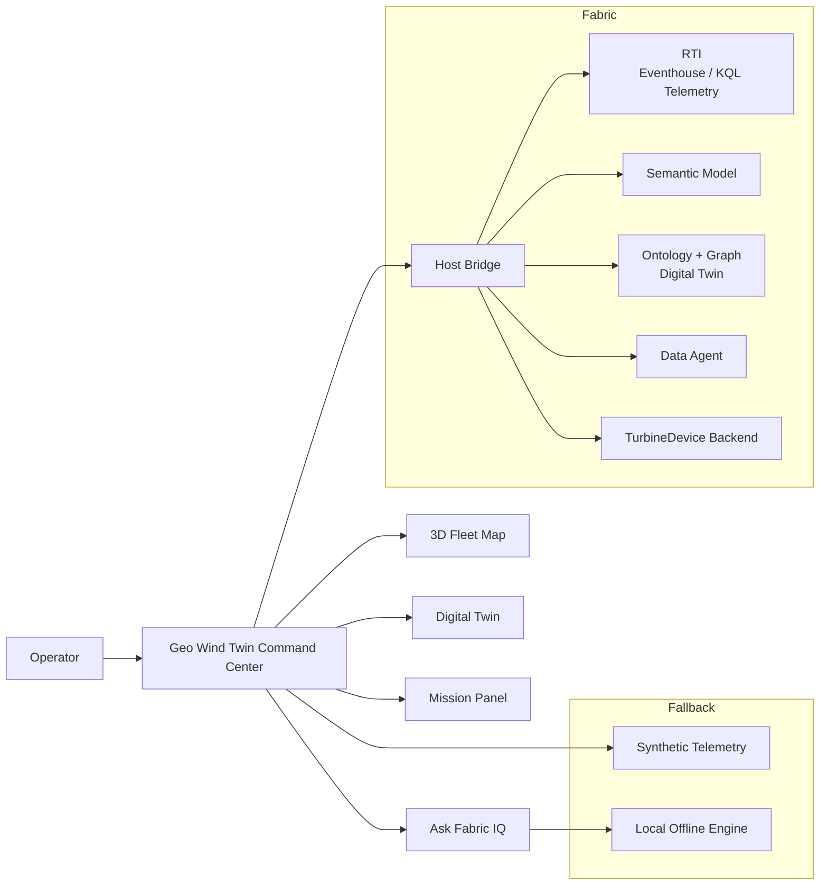
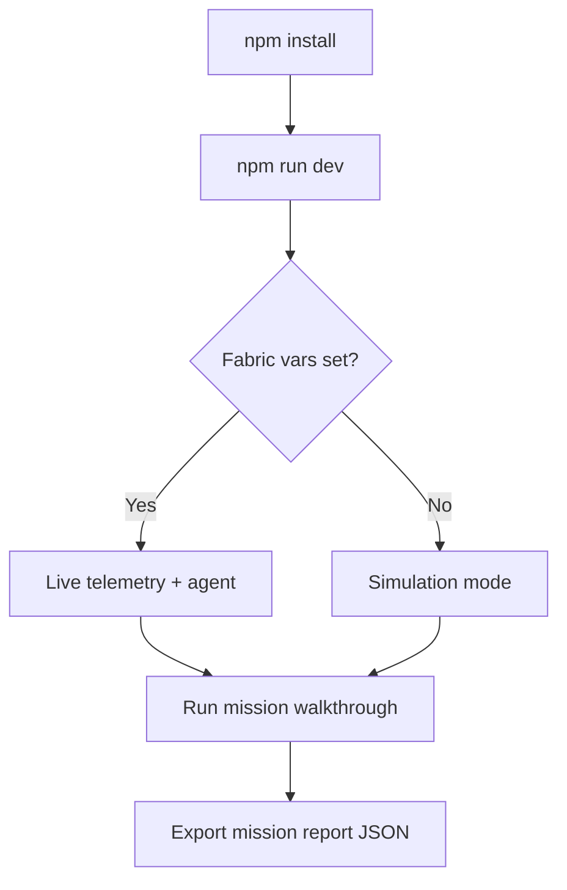

# Wind Turbine Rayfin App

<p align="center">
   
   
   
   
</p>

<p align="center">
   
   
   
   
</p>

## Hackathon Snapshot

### Problem Statement
Wind-farm operations teams often monitor telemetry, alarms, and maintenance context across disconnected tools, causing slower triage and inconsistent dispatch decisions.

### Target User
- Wind operations controller (NOC / dispatch)
- Site technicians and reliability engineers
- Field teams and customers evaluating reusable Rayfin templates

### What We Built
- Live multi-site 3D fleet map
- Turbine-level digital twin diagnostics
- Guided incident triage and dispatch actions
- Mission report export for evidence and handoff
- Ask Fabric IQ natural-language assistant
- Fallback-safe simulation mode when live Fabric wiring is unavailable

### Reusable Fabric Connections (Across Apps)
This pattern is reusable beyond Wind Turbine. Rayfin apps can be connected to:
- Real-Time Intelligence (RTI) — Eventhouse/KQL as the telemetry backend for live and near-real-time signals
- Ontology + Graph model as the backbone for the digital twin (asset topology, component/device relationships)
- Ontology Data Agent endpoints for natural-language, ontology-grounded Q&A
- Semantic Models for live telemetry aggregation and KPI querying
- Ontology-backed entities for writeback workflows (notes, dispatch, configuration)

Other industry variants already exist, showing the pattern generalizes across domains:
- Oil & Gas / Refinery: [refinery-worldwide-rayfin](../refinery-worldwide-rayfin/README.md)
- Solar: [solar-france-rayfin](../solar-france-rayfin/README.md)

### Solution Architecture



### Demo Flow



For a submission-focused version, see [README_HACKATHON.md](README_HACKATHON.md).

> **Geo Wind Twin Command Center** — an ontology-grounded, 3D digital-twin command center
> for multi-site wind turbine fleets, built on Fabric Rayfin
> (React 19 + Vite + Three.js + Vitest).

This app visualizes live turbine telemetry on a 3D geospatial map, exposes per-turbine
digital twins, forecasts power output, writes operational notes back to the Fabric ontology,
and answers natural-language questions ("Ask Fabric IQ"). It ships fallback-safe: with no
Fabric connection configured it runs on a synthetic telemetry generator, and it lights up
real data the moment the connection aliases are set.

The twin view now also persists its second-level component -> device graph in the
Fabric backend (`TurbineDevice`) and loads it at runtime, while still falling back to
the bundled defaults if the backend is unavailable.

The app also includes a Twin Graph Admin panel in the twin sidebar so operators can
edit persisted device metadata (labels, properties, notes, camera vectors, zoom/order),
save/reset changes, add sibling devices, and delete nodes with live scene refresh.

See [ROADMAP.md](ROADMAP.md) for shipped capabilities and the forward plan, and
[AGENTS.md](AGENTS.md) for build/agent guidance.


## Fabric connectivity

The app talks to Microsoft Fabric through three seams, all managed by the Rayfin CLI and
all fallback-safe:

| Seam | Files | Activation | Fallback when unset |
|------|-------|------------|---------------------|
| **Fabric host + client** | `src/lib/fabric-client.ts`, `src/fabric.generated.ts`, `fabric.yaml` | Provisioned by `rayfin` (workspace / item / tenant IDs land in `.env.local`); `getFabricClient()` proxies to the Fabric host via `postMessage` | Client no-ops locally |
| **Live telemetry** | `src/services/live-telemetry.service.ts` | Set `VITE_LIVE_TELEMETRY_MODEL` to the deployed **WindTurbine** semantic model — DAX (Direct Lake over the Lakehouse) pulls real turbine readings | Synthetic `buildFarm()` generator |
| **Data Agent** | `src/services/data-agent.service.ts` | Set `VITE_DATA_AGENT_URL` — "Ask Fabric IQ" routes to the deployed Fabric Data Agent (source `fabriciq`) | Ontology-grounded engine (`ontology`), then pure offline engine (`local`) |

The header badge and answer footers label the active source honestly
(`Fabric Data Agent (live)` / `Ontology-grounded engine` / `Local engine (offline)`), and
flag telemetry as **simulated** until `VITE_LIVE_TELEMETRY_MODEL` is set.

> `fabric.yaml` and `src/fabric.generated.ts` are intentionally empty stubs until a real
> semantic-model connection is wired — this is by design, not a missing step. The Rayfin
> host IDs in `.env.local` are what connect the running app to its Fabric workspace.


## Prerequisites

1. **Node.js (v22)**: Download and install from https://nodejs.org/dist/v22.22.2/node-v22.22.2-x64.msi
2. **GitHub Copilot CLI**: Refer to https://github.com/github/copilot-cli
3. **Azure CLI**: Install from https://learn.microsoft.com/en-us/cli/azure/install-azure-cli?view=azure-cli-latest. After installation, run `az login` to sign in to your Azure account.


## Getting started

1. **Install dependencies**: `npm install`
2. **Provision / refresh the Fabric host** (optional for local dev): `rayfin env` writes the
   workspace / item / tenant IDs into `.env.local`.
3. **Run the app**: `npm run dev`, then open http://localhost:5173.
4. **Run the tests**: `npm test` (Vitest).
5. **Build for Fabric**: `npm run build:fabric`.
6. **Deploy**: `rayfin up`.
7. **Open the Fabric shell**: open the artifact in the Fabric portal and append
   `&devUri=http://localhost:5173` to preview local changes inside the host.


## Enabling real Fabric data

Add the connection aliases to `.env.local` (they are read via `import.meta.env`):

```dotenv
# Real turbine telemetry from the deployed WindTurbine semantic model
VITE_LIVE_TELEMETRY_MODEL=<semantic-model-name-or-dataset-id>

# Real natural-language answers from the deployed Fabric Data Agent
VITE_DATA_AGENT_URL=<data-agent-endpoint>

# Optional auth for runtime endpoint (default: bearer)
VITE_DATA_AGENT_KEY=<token-or-key>
VITE_DATA_AGENT_AUTH_SCHEME=bearer
# or
# VITE_DATA_AGENT_AUTH_SCHEME=api-key
# VITE_DATA_AGENT_API_KEY_HEADER=x-api-key

# Optional transport preference (auto | mcp | legacy)
# VITE_DATA_AGENT_MODE=mcp

# Optional MCP tool name override (default: ask_data_agent)
# VITE_DATA_AGENT_MCP_TOOL=ask_data_agent

# Optional healthcheck prompt used by the Ask panel "Test Data Agent" button
# VITE_DATA_AGENT_HEALTHCHECK_PROMPT=Return connectivity-ok.
```

For MCP runtime auth, generate a Fabric access token and place it in `VITE_DATA_AGENT_KEY`:

```powershell
az account get-access-token --resource https://api.fabric.microsoft.com --query accessToken -o tsv
```

Token note: this bearer token expires (typically around 1 hour), so renew it when Ask/Test starts returning `401`.

With neither set, the app is fully functional on synthetic data — no Fabric round-trips.

### Quick "prepare everything" checklist

1. Set `VITE_DATA_AGENT_URL` in `.env.local`.
2. If your endpoint requires auth, set `VITE_DATA_AGENT_KEY` and one of:
   `VITE_DATA_AGENT_AUTH_SCHEME=bearer` or `VITE_DATA_AGENT_AUTH_SCHEME=api-key`
   (with `VITE_DATA_AGENT_API_KEY_HEADER` when using API key mode).
3. Optionally set `VITE_DATA_AGENT_MODE` to `mcp` or `legacy` if auto-detection is not ideal.
4. Start the app (`npm run dev`), open **Ask Fabric IQ**, and click **Test Data Agent**.
5. Confirm a green health message and inspect Mode/Auth/Transport details shown in the panel.


## Related

- [IQ Ontology Accelerator](../../README.md) — parent repo (7 ontology domains + deployment engine)
- [Solar France Rayfin App](../solar-france-rayfin/README.md) — Geo Solar Twin (SolarFarm model, France)
- [Refinery Worldwide Rayfin App](../refinery-worldwide-rayfin/README.md) — Geo Refinery Twin (OilGasRefinery model)
- [ROADMAP.md](ROADMAP.md) — shipped capabilities and forward plan


## Need help?

If you have any questions or run into any problems, please [file an issue](../../issues) on this repository.