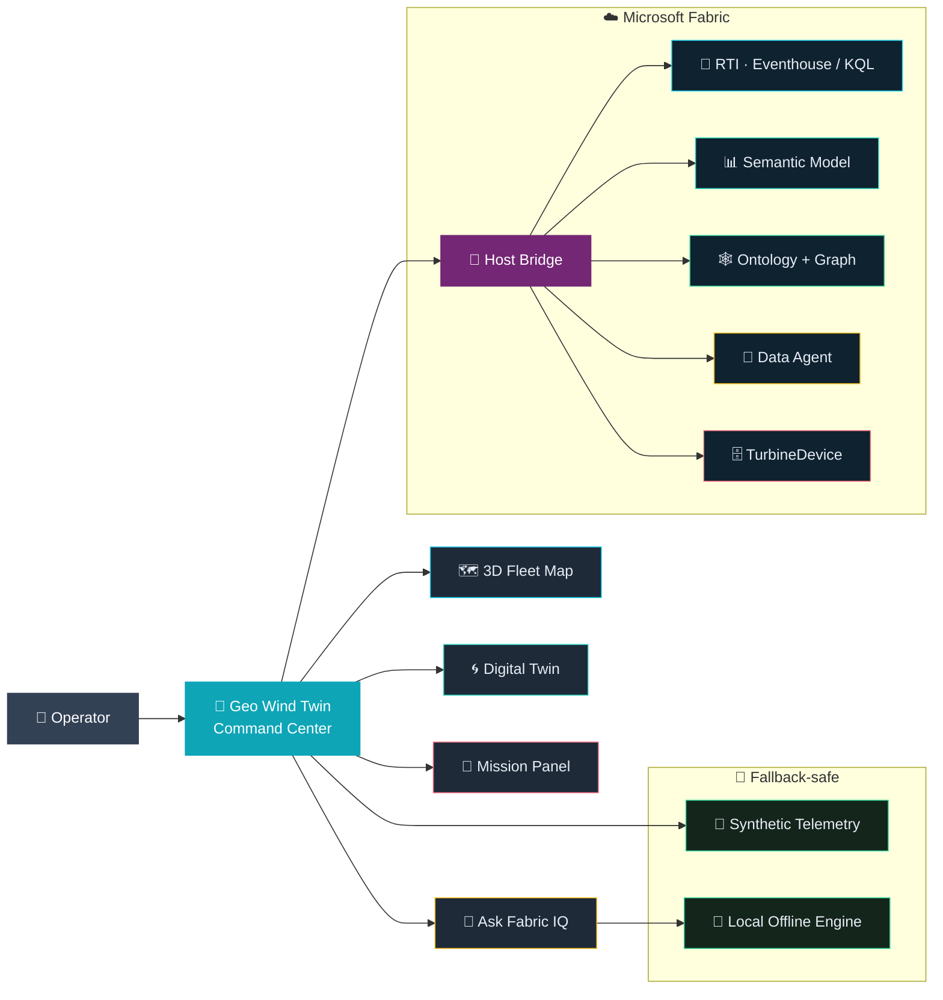
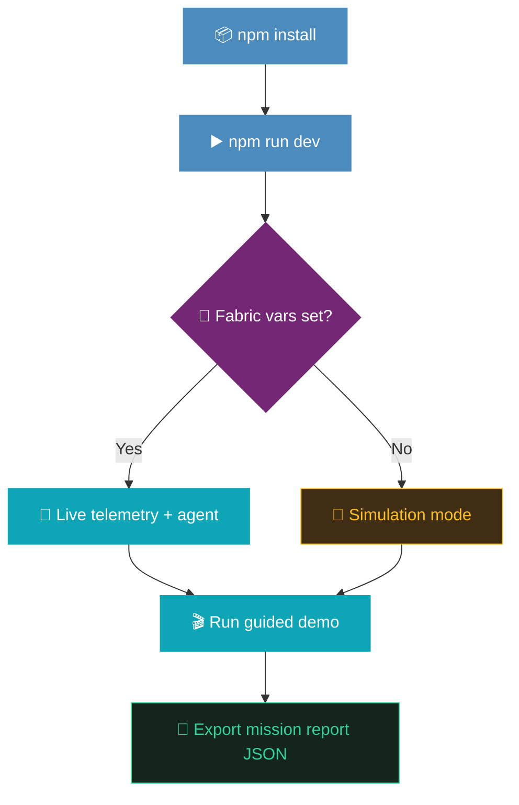

# Wind Turbine Rayfin App

<p align="center">
   
   
   
   
</p>

<p align="center">
   
   
   
   
</p>

<p align="center">
   <b>Geo Wind Twin Command Center</b> — an ontology-grounded, 3D digital-twin command center for
   multi-site wind fleets, built on <b>Microsoft Fabric</b> + <b>Rayfin</b>, and <b>fallback-safe by design</b>.
</p>

<p align="center">
   
   
   
   
   
</p>

<p align="center">
   🎥 <a href="Rayfin-Windturbine-AutoDemo.mp4"><b>Auto-demo video</b></a>
   &nbsp;·&nbsp;
   📊 <a href="Fabric-Rayfin-Wind-Turbine.pptx"><b>Explainer deck (PPTX)</b></a>
   &nbsp;·&nbsp;
   🌐 <a href="https://naive-cave-f911045ee7-westcentralus.webapp.msit.fabricapps.net"><b>Live app</b></a>
</p>

<table>
<tr><td>🏷️ <b>Stack</b></td><td>React 19 · Vite · TypeScript · Three.js · Vitest</td></tr>
<tr><td>🧩 <b>Backend</b></td><td>Microsoft Fabric — RTI (Eventhouse/KQL) · Semantic Model · Ontology + Graph · Data Agent</td></tr>
<tr><td>✅ <b>Tests</b></td><td>155 Vitest specs · deterministic mission/telemetry helpers</td></tr>
<tr><td>🛟 <b>Runtime</b></td><td>Fallback-safe — live telemetry <b>or</b> synthetic simulation</td></tr>
<tr><td>🎬 <b>Demo</b></td><td>8-step guided walkthrough (~92s) with mission-report export</td></tr>
</table>

---

## ✨ Highlights

<table>
<tr>
<td width="50%">

### 🗺️ Live fleet map
Multi-site **3D geospatial** map with turbine-level status, selection, and status-aware filtering across every wind corridor.

</td>
<td width="50%">

### 🌀 Digital twin
Per-turbine **component → device** diagnostics in an interactive Three.js scene, with a persisted device graph and in-app editor.

</td>
</tr>
<tr>
<td>

### 🕸️ Ontology graph
Trace **asset topology and dependencies** (Fleet → Site → Turbine → Component → Device) to confirm the probable cause.

</td>
<td>

### 🛠️ Guided dispatch
Match the **best technician** on skills, site and load, raise a tracked work order, and close the loop — with SLA + escalation.

</td>
</tr>
<tr>
<td>

### 🤖 Ask Fabric IQ
**Natural-language**, ontology-grounded answers with a fleet-health snapshot and honest source labeling.

</td>
<td>

### 📊 Analytics & report
Output **trends, deltas and the power curve**, plus an exportable **mission report** (JSON) with a full incident timeline.

</td>
</tr>
<tr>
<td colspan="2">

### 🛟 Fallback-safe by design
Runs fully on a **synthetic telemetry generator** and a local engine offline, then **lights up live data** the moment Fabric connection aliases are set — no code changes.

</td>
</tr>
</table>

> [!NOTE]
> **What is Rayfin?** Rayfin is Microsoft Fabric's framework for building full **web apps** —
> not just report tiles — that are **hosted natively inside the Fabric shell**. This app is a
> React 19 + Vite + Three.js SPA, **provisioned and deployed by the `rayfin` CLI**, and wired to
> Fabric data through a `postMessage` **host bridge**. The same code runs locally for dev and
> inside the Fabric portal, and stays **fallback-safe** when no connection is configured.

**How Rayfin powers this app**

| 🧩 Rayfin capability | 🌀 How the Wind Turbine app uses it |
|---|---|
| **Native Fabric hosting** | Renders the full 3D Three.js command center *inside* the Fabric shell — a real SPA, not a tile |
| **`rayfin` CLI provisioning** | Writes workspace / item / tenant IDs into `.env.local` so the app finds its workspace |
| **`postMessage` host bridge** | `getFabricClient()` reaches Fabric data (semantic model, Data Agent, ontology) without custom auth plumbing |
| **One-command deploy** | `rayfin up` builds and ships the static app to the Fabric workspace |
| **Fallback-safe scaffolding** | Cleanly degrades to synthetic telemetry + a local engine when connections are unset — demos never break |
| **Reusable app template** | The same shell + demo engine power the Solar and Refinery variants from per-domain manifests |

## 📚 Table of contents

- 🏁 [Hackathon Snapshot](#hackathon-snapshot)
- 🔌 [Fabric connectivity](#fabric-connectivity)
- 🧰 [Prerequisites](#prerequisites)
- 🚀 [Getting started](#getting-started)
- 🎬 [Guided demo script](#guided-demo-script)
- ⚙️ [Enabling real Fabric data](#enabling-real-fabric-data)
- 🔗 [Related](#related)

## Hackathon Snapshot

### 🎯 Problem Statement
Wind-farm operations teams often monitor telemetry, alarms, and maintenance context across disconnected tools, causing slower triage and inconsistent dispatch decisions.

### 👥 Target User
- Wind operations controller (NOC / dispatch)
- Site technicians and reliability engineers
- Field teams and customers evaluating reusable Rayfin templates

### 🛠️ What We Built
- Live multi-site 3D fleet map
- Turbine-level digital twin diagnostics
- Guided incident triage and dispatch actions
- Mission report export for evidence and handoff
- Ask Fabric IQ natural-language assistant
- Fallback-safe simulation mode when live Fabric wiring is unavailable

### 🔌 Reusable Fabric Connections (Across Apps)
This pattern is reusable beyond Wind Turbine. Rayfin apps can be connected to:
- Real-Time Intelligence (RTI) — Eventhouse/KQL as the telemetry backend for live and near-real-time signals
- Ontology + Graph model as the backbone for the digital twin (asset topology, component/device relationships)
- Ontology Data Agent endpoints for natural-language, ontology-grounded Q&A
- Semantic Models for live telemetry aggregation and KPI querying
- Ontology-backed entities for writeback workflows (notes, dispatch, configuration)

Other industry variants already exist, showing the pattern generalizes across domains:
- Oil & Gas / Refinery: [refinery-worldwide-rayfin](../refinery-worldwide-rayfin/README.md)
- Solar: [solar-france-rayfin](../solar-france-rayfin/README.md)

### Solution Architecture



### Demo Flow



### Use-case strength & impact

When incidents spike, an operator must identify the highest-risk turbine, understand the
probable cause, and dispatch the right response. This app prioritizes risky assets on a
status-aware map and mission panel, exposes turbine-level context through the digital twin,
guides triage → dispatch, and produces a mission report for handoff.

- **Faster time-to-triage** for critical alarms
- **More consistent first-response** decisions
- **Better cross-team communication** through exportable run reports

### Reusability & quality

- Reusable **industry-template pattern** for Rayfin — config-driven wiring via environment variables, working both online (Fabric-connected) and offline (simulation).
- Sibling variants prove the pattern generalizes: [refinery-worldwide-rayfin](../refinery-worldwide-rayfin/README.md) and [solar-france-rayfin](../solar-france-rayfin/README.md).
- **Quality signals**: unit tests for mission logic and telemetry services, deterministic scoring/reporting helpers, explicit source labeling for trust, and a fallback path that prevents demo breakage.

### Uniqueness

- Geospatial fleet awareness **and** turbine-level twin diagnostics in one app.
- Mission-style **guided storytelling** for operational incident scenarios.
- Exportable, structured **run evidence** (mission report) for reproducible demos.
- A **persistent device graph** bridging the visual twin and operational metadata.

### Product feedback (Rayfin / Fabric)

- **Worked well**: fast iteration with the Rayfin app structure; clean separation of host integration vs. local dev; strong composability of telemetry and AI answer surfaces.
- **Gaps**: connection-wiring discoverability, live-data handshake diagnostics, and more mission-based UX starter patterns.
- **Suggestions**: a first-run connection wizard, standardized telemetry-source health badges, and packaged incident-response template blocks (panel, scoring, reporting).

### Submission

- **Repository**: https://github.com/cyphou/Ontology-RTI
- **App folder**: `apps/wind-turbine-rayfin` · **Final branch**: `main`
- **Checklist**: public repo ✓ · app on `main` ✓ · problem, target user & architecture documented ✓ · implementation explained ✓

> A standalone, printable submission version is also available in [README_HACKATHON.md](README_HACKATHON.md).

> **Geo Wind Twin Command Center** — an ontology-grounded, 3D digital-twin command center
> for multi-site wind turbine fleets, built on Fabric Rayfin
> (React 19 + Vite + Three.js + Vitest).

This app visualizes live turbine telemetry on a 3D geospatial map, exposes per-turbine
digital twins, forecasts power output, writes operational notes back to the Fabric ontology,
and answers natural-language questions ("Ask Fabric IQ"). It ships fallback-safe: with no
Fabric connection configured it runs on a synthetic telemetry generator, and it lights up
real data the moment the connection aliases are set.

The twin view now also persists its second-level component -> device graph in the
Fabric backend (`TurbineDevice`) and loads it at runtime, while still falling back to
the bundled defaults if the backend is unavailable.

The app also includes a Twin Graph Admin panel in the twin sidebar so operators can
edit persisted device metadata (labels, properties, notes, camera vectors, zoom/order),
save/reset changes, add sibling devices, and delete nodes with live scene refresh.

See [ROADMAP.md](ROADMAP.md) for shipped capabilities and the forward plan, and
[AGENTS.md](AGENTS.md) for build/agent guidance.


## Fabric connectivity

The app talks to Microsoft Fabric through three seams, all managed by the Rayfin CLI and
all fallback-safe:

| Seam | Files | Activation | Fallback when unset |
|------|-------|------------|---------------------|
| **Fabric host + client** | `src/lib/fabric-client.ts`, `src/fabric.generated.ts`, `fabric.yaml` | Provisioned by `rayfin` (workspace / item / tenant IDs land in `.env.local`); `getFabricClient()` proxies to the Fabric host via `postMessage` | Client no-ops locally |
| **Live telemetry** | `src/services/live-telemetry.service.ts` | Set `VITE_LIVE_TELEMETRY_MODEL` to the deployed **WindTurbine** semantic model — DAX (Direct Lake over the Lakehouse) pulls real turbine readings | Synthetic `buildFarm()` generator |
| **Data Agent** | `src/services/data-agent.service.ts` | Set `VITE_DATA_AGENT_URL` — "Ask Fabric IQ" routes to the deployed Fabric Data Agent (source `fabriciq`) | Ontology-grounded engine (`ontology`), then pure offline engine (`local`) |

The header badge and answer footers label the active source honestly
(`Fabric Data Agent (live)` / `Ontology-grounded engine` / `Local engine (offline)`), and
flag telemetry as **simulated** until `VITE_LIVE_TELEMETRY_MODEL` is set.

> `fabric.yaml` and `src/fabric.generated.ts` are intentionally empty stubs until a real
> semantic-model connection is wired — this is by design, not a missing step. The Rayfin
> host IDs in `.env.local` are what connect the running app to its Fabric workspace.


## Prerequisites

1. **Node.js (v22)**: Download and install from https://nodejs.org/dist/v22.22.2/node-v22.22.2-x64.msi
2. **GitHub Copilot CLI**: Refer to https://github.com/github/copilot-cli
3. **Azure CLI**: Install from https://learn.microsoft.com/en-us/cli/azure/install-azure-cli?view=azure-cli-latest. After installation, run `az login` to sign in to your Azure account.


## Getting started

> [!TIP]
> New here? Run `npm install && npm run dev`, open the app, then click **▶ Demo → Run all**
> for a ~92s guided tour — **no Fabric wiring required** (it runs on synthetic telemetry).

1. **Install dependencies**: `npm install`
2. **Provision / refresh the Fabric host** (optional for local dev): `rayfin env` writes the
   workspace / item / tenant IDs into `.env.local`.
3. **Run the app**: `npm run dev`, then open http://localhost:5173.
4. **Run the tests**: `npm test` (Vitest).
5. **Build for Fabric**: `npm run build:fabric`.
6. **Deploy**: `rayfin up`.
7. **Open the Fabric shell**: open the artifact in the Fabric portal and append
   `&devUri=http://localhost:5173` to preview local changes inside the host.


## Guided demo script

The app ships a **guided demo** that walks one live incident end to end — from detection
to resolution — so a jury or customer can follow the full story without knowing the UI.

### How to run it

- Click **▶ Demo** in the header to open the demo controls, then:
  - **Run all** — plays the whole scripted walkthrough automatically.
  - **Run step** — runs the current step only; use **◀ / ▶** (or the **←/→** arrow keys) to move between steps, **Enter** to run.
- It is **fallback-safe**: the script runs identically in simulation mode (no Fabric wiring),
  driving synthetic telemetry and the local offline engine.

### Pacing

Each page dwells for **~10s**, with a **~5s** pause before the in-page action fires
(e.g. applying a filter, clicking the rotor), so the audience can read the context first.

### The eight steps

| # | Step | 👁 See | 🖱 Action |
|---|------|--------|-----------|
| 1 | **Frame the incident** | Incident summary — turbine, probable component, priority, lead technician | Auto-frames the top incident on the map |
| 2 | **Locate on the map** | The affected wind site and its turbines | Applies the site filter to zoom in |
| 3 | **Digital twin** | The 3D turbine — rotor blades and pitch signals | Clicks the rotor, then the pitch-control device |
| 4 | **Ontology graph** | The incident node with its component & device branches | Clicks through the related graph nodes |
| 5 | **Dispatch** | The best-matched technician and dispatch popup | Raises and assigns the work order |
| 6 | **Field support** | Field-support status and the closed maintenance loop | Calls field support and closes the loop |
| 7 | **Ask Fabric IQ** | The plain-language answer and fleet-health snapshot | Submits the question to Fabric IQ |
| 8 | **Analytics & report** | Output trends, deltas and the wind-power curve | Opens the mission report |

Throughout, a **narration banner** shows the step title, an end-to-end caption on step 1,
a progress bar, and per-step **See / Action** cues. The finale opens a **mission report
modal** (verdict, dispatch quality, timeline of every step) with a **Download JSON** export.

### Reusable & domain-agnostic

The script is **data-driven** from a per-domain manifest, so the same engine powers the
Solar and Refinery apps with their own nouns and evidence:

- Step order, narration, and See/Action cues: `src/services/demo-experience.service.ts`
  (`WIND_DEMO_MANIFEST`, `SOLAR_DEMO_MANIFEST`, `REFINERY_DEMO_MANIFEST`, `DEMO_STEP_ORDER`).
- Auto-run + step-by-step orchestration and the mission report: `src/App.tsx`
  (`handleAutoRunDemo`, `demoScriptSteps`, `handleOpenMissionReport`).


## Enabling real Fabric data

Add the connection aliases to `.env.local` (they are read via `import.meta.env`):

```dotenv
# Real turbine telemetry from the deployed WindTurbine semantic model
VITE_LIVE_TELEMETRY_MODEL=<semantic-model-name-or-dataset-id>

# Real natural-language answers from the deployed Fabric Data Agent
VITE_DATA_AGENT_URL=<data-agent-endpoint>

# Optional auth for runtime endpoint (default: bearer)
VITE_DATA_AGENT_KEY=<token-or-key>
VITE_DATA_AGENT_AUTH_SCHEME=bearer
# or
# VITE_DATA_AGENT_AUTH_SCHEME=api-key
# VITE_DATA_AGENT_API_KEY_HEADER=x-api-key

# Optional transport preference (auto | mcp | legacy)
# VITE_DATA_AGENT_MODE=mcp

# Optional MCP tool name override (default: ask_data_agent)
# VITE_DATA_AGENT_MCP_TOOL=ask_data_agent

# Optional healthcheck prompt used by the Ask panel "Test Data Agent" button
# VITE_DATA_AGENT_HEALTHCHECK_PROMPT=Return connectivity-ok.
```

For MCP runtime auth, generate a Fabric access token and place it in `VITE_DATA_AGENT_KEY`:

```powershell
az account get-access-token --resource https://api.fabric.microsoft.com --query accessToken -o tsv
```

Token note: this bearer token expires (typically around 1 hour), so renew it when Ask/Test starts returning `401`.

> [!NOTE]
> With neither variable set, the app is **fully functional on synthetic data** — no Fabric round-trips.

### Quick "prepare everything" checklist

1. Set `VITE_DATA_AGENT_URL` in `.env.local`.
2. If your endpoint requires auth, set `VITE_DATA_AGENT_KEY` and one of:
   `VITE_DATA_AGENT_AUTH_SCHEME=bearer` or `VITE_DATA_AGENT_AUTH_SCHEME=api-key`
   (with `VITE_DATA_AGENT_API_KEY_HEADER` when using API key mode).
3. Optionally set `VITE_DATA_AGENT_MODE` to `mcp` or `legacy` if auto-detection is not ideal.
4. Start the app (`npm run dev`), open **Ask Fabric IQ**, and click **Test Data Agent**.
5. Confirm a green health message and inspect Mode/Auth/Transport details shown in the panel.


## Related

- [IQ Ontology Accelerator](../../README.md) — parent repo (7 ontology domains + deployment engine)
- [Solar France Rayfin App](../solar-france-rayfin/README.md) — Geo Solar Twin (SolarFarm model, France)
- [Refinery Worldwide Rayfin App](../refinery-worldwide-rayfin/README.md) — Geo Refinery Twin (OilGasRefinery model)
- [ROADMAP.md](ROADMAP.md) — shipped capabilities and forward plan


## Need help?

If you have any questions or run into any problems, please [file an issue](../../issues) on this repository.

---

<p align="center">
  <sub>Built with 💨 on <b>Microsoft Fabric</b> + <b>Rayfin</b> · React 19 · Vite · Three.js · Vitest</sub><br/>
  <sub>Part of the <a href="../../README.md">IQ Ontology Accelerator</a> — reusable industry twins for Microsoft Fabric.</sub>
</p>