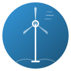
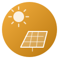
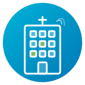
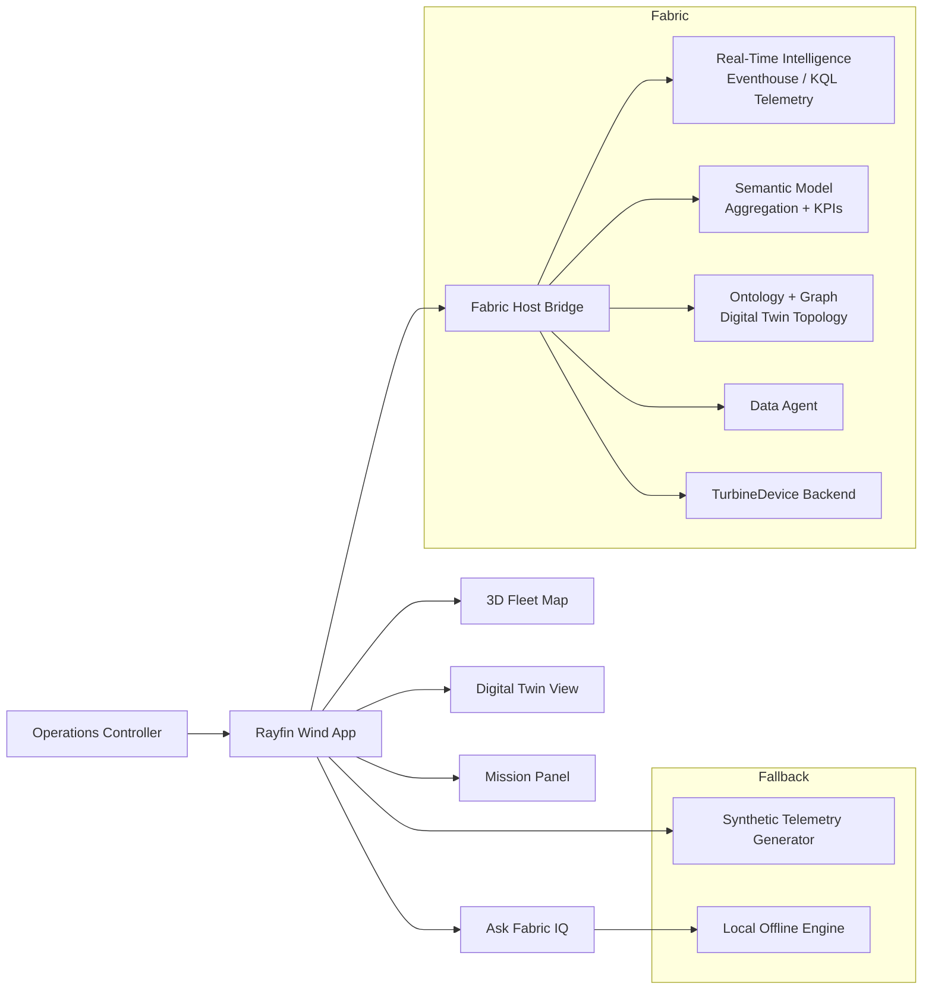
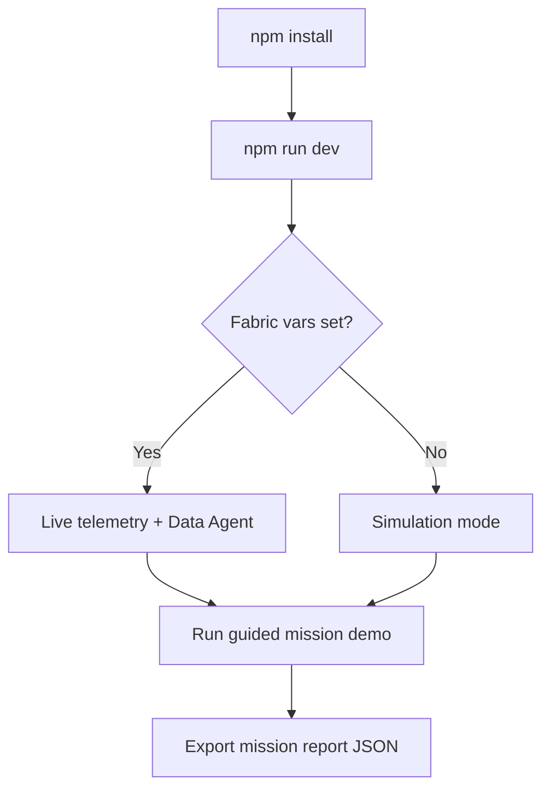

# Wind Turbine Rayfin App - Hackathon Submission

> If your environment blocks external badge hosts, local icons and emoji markers below provide the same visual cues.

   
   
   

   
   
   
   

   
   
   
   

## Project
**Geo Wind Twin Command Center**

### 🌟 At a Glance
- 🧭 Operations-first wind command center
- 🛰️ Live or simulated telemetry
- 🤖 Ontology Data Agent + Fabric integrations
- 📦 Exportable mission evidence for judges

A Rayfin + Microsoft Fabric demo app for wind-farm operations that combines a live fleet map, per-turbine digital twins, AI-assisted triage, and mission reporting.

## Quick Navigation
- [1) Problem Statement](#1-problem-statement)
- [2) Target User](#2-target-user)
- [3) Use-Case Strength and Impact](#3-use-case-strength-and-impact)
- [4) What We Built](#4-what-we-built)
- [5) Solution Architecture](#5-solution-architecture)
- [6) Reusability and Quality](#6-reusability-and-quality)
- [7) Uniqueness](#7-uniqueness)
- [8) Product Feedback Quality](#8-product-feedback-quality)
- [9) Demo and Run Instructions](#9-demo-and-run-instructions)
- [10) Submission Metadata](#10-submission-metadata)
- [Submission Checklist](#submission-checklist)

## 1) Problem Statement
### 🎯 Problem Statement
Wind-farm operations teams often monitor telemetry, alarms, and maintenance context across disconnected tools. This causes slower triage, delayed dispatch decisions, and inconsistent operator handoffs.

This project addresses that gap with one operational command center that unifies live status, diagnostics, and action workflows in a single experience.

## 2) Target User
### 👥 Target User
- Primary user: Wind operations controller (NOC / dispatch operator)
- Secondary users: Site technicians, reliability engineers, and demo/field solution architects
- Stakeholders: Energy customers evaluating Fabric Apps and Rayfin reusable templates

## 3) Use-Case Strength and Impact
### ⚡ Use-Case Strength and Impact
### Core use-case
When incidents spike, an operator needs to quickly identify the highest-risk turbine, understand probable cause, and dispatch the right response.

### How this app resolves it
- Prioritizes risky assets with status-aware map and mission panel
- Exposes turbine-level context through a digital twin view
- Guides actions through triage and dispatch flows
- Produces a mission report artifact for review and handoff

### Expected impact
- Faster time-to-triage for critical alarms
- More consistent first-response decisions
- Better cross-team communication through exportable run reports

## 4) What We Built
### 🛠️ What We Built
- 3D multi-site wind fleet map with turbine-level selection
- Digital twin scene with component and device hierarchy
- Persisted twin-device metadata in Fabric backend (`TurbineDevice`)
- Mission panel (overview, risk, actions) with challenge scoring
- Guided demo script with step narration and run history
- Mission report export (JSON) for traceability and judging evidence
- Ask Fabric IQ pathway for natural-language operational Q&A
- Fallback-safe runtime: full local simulation when live Fabric connections are not configured

### Reusable Fabric Connections (Across Apps)
This approach is reusable beyond the wind scenario. Rayfin apps can connect to:
- Real-Time Intelligence (RTI) — Eventhouse/KQL as the telemetry backbone for live and near-real-time signals
- Ontology + Graph model as the backbone for the digital twin (asset topology, component/device relationships)
- Ontology Data Agent endpoints for ontology-grounded Q&A
- Semantic Models for live telemetry aggregation and KPI queries
- Ontology-backed entities for writeback workflows (notes, dispatch, configuration)

## 5) Solution Architecture
### 🏗️ Solution Architecture

### Stack
- Rayfin Fabric App shell
- React 19 + Vite + TypeScript
- Three.js for 3D digital twin scenes
- Vitest + Testing Library for quality checks

### Fabric integration seams
1. Fabric host/client bridge
2. Real-Time Intelligence (RTI): Eventhouse/KQL as the telemetry backend for streaming signals
3. Semantic model telemetry (Direct Lake-backed aggregation and KPIs)
4. Ontology + Graph model powering the digital twin topology and relationships
5. Data Agent for natural-language answers

### Data modes
- Live mode: connected to Fabric semantic model + agent
- Simulation mode: synthetic telemetry generator with same UX surfaces

## 6) Reusability and Quality
### ♻️ Reusability and Quality
### Reusability
- Designed as a reusable industry template pattern for Rayfin
- Config-driven runtime wiring through environment variables
- Works both online (Fabric-connected) and offline (simulation)

### Quality signals
- Unit tests for mission logic and telemetry services
- Deterministic helper services for scoring and reporting
- Clear fallback behavior to prevent demo breakage
- Operator-focused UX with explicit source labeling for trust

## 7) Uniqueness
### 💎 Uniqueness
- Combines geospatial fleet awareness and turbine-level twin diagnostics in one app
- Adds mission-style guided storytelling for operational incident scenarios
- Includes exportable, structured run evidence (mission report) for reproducible demos
- Uses a persistent device graph model to bridge visual twin and operational metadata

## 8) Product Feedback Quality
### 🧠 Product Feedback Quality
### What worked well
- Fast iteration cycle with Rayfin app structure
- Good separation between host integration and local dev
- Strong composability for telemetry and AI answer surfaces

### Gaps observed
- Discoverability of connection wiring can be improved for first-time builders
- More built-in diagnostics for live-data handshake states would reduce setup friction
- More starter patterns for mission-based operational UX would accelerate template creation

### Suggested improvements
- Add a first-run connection wizard in Rayfin templates
- Add standardized telemetry-source health badges/components
- Provide packaged incident response template blocks (panel, scoring, reporting)

## 9) Demo and Run Instructions
### 🎬 Demo and Run Instructions

1. Install dependencies: `npm install`
2. Start local app: `npm run dev`
3. Optional Fabric wiring:
    - Set `VITE_LIVE_TELEMETRY_MODEL`
    - Set `VITE_DATA_AGENT_URL`
    - Set `VITE_DATA_AGENT_KEY` if required
4. Open Mission Panel and run guided demo flow
5. Export Mission Report JSON as judging artifact

## 10) Submission Metadata
### 📌 Submission Metadata
- Repository: https://github.com/cyphou/Ontology-RTI
- App folder: `apps/wind-turbine-rayfin`
- Final branch for submission: `main`

## Submission Checklist
### ✅ Submission Checklist
- [x] Public repository link provided
- [x] Final app available on `main`
- [x] Problem statement documented
- [x] Target user documented
- [x] Solution architecture documented
- [x] Concise explanation of implementation included

## Contact
For questions or follow-up during judging, use the repository issue tracker or the submitting team contact.