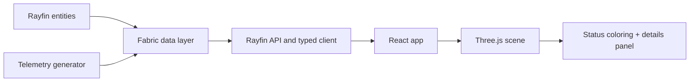

# Building a Fabric Digital Twin with Rayfin - Part 1: From Empty Workspace to a Live 3D Prototype

## Series overview

This post is Part 1 of a three-part series:

1. Part 1 (this post): first prototype - a Rayfin app with a Three.js scene driven by database telemetry.
2. Part 2: a realistic turbine and terrain pipeline from Blender and geospatial source data.
3. Part 3: a real-time Foundry copilot over Fabric KQL with text and voice interaction.

The objective is simple: prove the 3D twin is live, data-driven, and deployable in Fabric.

## What we are building

A wind farm digital twin where each turbine:

1. Exists as data in a Fabric-backed model.
2. Renders in a browser-based Three.js scene.
3. Updates visual state from live telemetry.
4. Exposes metrics on selection.

By the end of Part 1, we have an app that can be shown to operations teams as a credible starting point.

## Why Rayfin for this workflow

Rayfin provides an app development model where your backend, auth, and data integration are aligned with Microsoft Fabric from day one.

The key benefits for this use case:

1. TypeScript entity modeling with generated data services.
2. Fast local development loop.
3. Fabric-authenticated deployment path with SSO.

For a digital twin, this means less infrastructure plumbing and faster focus on scene-data behavior.

## Architecture for Part 1



## Step 1 - Scaffold the app

Create a new Fabric App and follow the generated startup instructions.

Core outcome for this step:

1. A working local app runtime.
2. Fabric-authenticated deploy path.
3. A place to define entities and UI in one project.

## Step 2 - Define the data model

Start with entities that are stable enough to survive future parts of the series.

### Example: Turbine entity

```ts
import {
  authenticated,
  decimal,
  entity,
  text,
  uuid,
} from '@microsoft/rayfin-core';

@entity()
@authenticated('*')
export class Turbine {
  @uuid() id!: string;
  @text({ max: 40, unique: true }) turbineId!: string;
  @text({ max: 120 }) name!: string;
  @text({ max: 120 }) type!: string;
  @decimal() ratedCapacity!: number;
  @decimal({ precision: 9, scale: 5, optional: true }) latitude?: number;
  @decimal({ precision: 9, scale: 5, optional: true }) longitude?: number;
}
```

### Example: Telemetry entity

```ts
import {
  authenticated,
  decimal,
  entity,
  int,
  text,
  uuid,
} from '@microsoft/rayfin-core';

@entity()
@authenticated('*')
export class TurbineTelemetry {
  @uuid() id!: string;
  @text({ max: 40 }) turbineId!: string;
  @decimal() powerKw!: number;
  @decimal() nacelleTempC!: number;
  @decimal() vibrationMmS!: number;
  @int() windSpeedMs!: number;
  @text({ max: 20 }) status!: string; // healthy | warning | alarm
  @text({ max: 40 }) observedAt!: string;
}
```

Modeling rule that pays off later: use stable business IDs (for example WT-01) as binding keys between scene objects and telemetry rows.

## Step 3 - Seed data and create a telemetry loop

Seed the initial wind farm and run a periodic updater that writes telemetry snapshots.

For Part 1, a polling loop every 2 seconds is enough to validate the end-to-end pipeline.

Telemetry status can be derived from simple thresholds:

1. healthy: values in expected operating range.
2. warning: out-of-range but non-critical.
3. alarm: critical threshold exceeded.

## Step 4 - Build the first 3D scene with Three.js

Start intentionally simple:

1. Ground plane.
2. Camera controls.
3. 8 to 12 turbine objects on fixed coordinates.
4. Click selection.
5. Color status from telemetry.

### Example: status-driven turbine material

```tsx
const color =
  status === 'alarm' ? '#d64545' :
  status === 'warning' ? '#e5a623' : '#7bc96f';
```

### Example: update loop

```ts
useEffect(() => {
  let timer: number | undefined;

  async function refresh() {
    const latest = await fetch('/api/telemetry/latest').then((r) => r.json());
    setTurbines((prev) =>
      prev.map((t) => ({
        ...t,
        status: latest[t.turbineId]?.status ?? 'healthy',
      }))
    );
    timer = window.setTimeout(refresh, 2000);
  }

  refresh();
  return () => timer && clearTimeout(timer);
}, []);
```

## Step 5 - Deploy to Fabric

Once local behavior is stable:

1. Deploy using Rayfin deployment workflow.
2. Validate SSO access.
3. Verify scene updates against deployed data.

This closes the key loop: one app, one model, one deployment path.

## Demo checklist used for Part 1

1. Scene loads with expected turbines.
2. Telemetry updates are visible in less than 3 seconds.
3. Selection panel shows latest metrics and timestamp.
4. No unmapped scene object IDs.
5. App runs both locally and in Fabric-hosted mode.

## Common pitfalls and fixes

1. Pitfall: scene object IDs do not match turbineId.
2. Fix: centralize a mapping table and validate on startup.

3. Pitfall: stale telemetry appears as healthy.
4. Fix: add freshness logic and explicit stale UI state.

5. Pitfall: local success but deploy-time auth failures.
6. Fix: validate auth path in Fabric early, not at the end.

## What comes next in Part 2

Part 2 upgrades the visual layer without changing the data contract:

1. Replace primitive turbines with Blender assets.
2. Add realistic terrain from source geospatial data.
3. Keep telemetry and selection bindings unchanged.

That separation is intentional. The platform contract remains stable while visual fidelity evolves.
