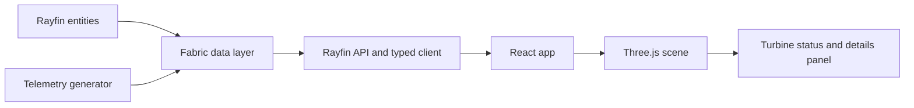

# Wind Turbine Rayfin App Plan

## Purpose

This plan defines how to build and ship a Fabric Rayfin app for a wind farm digital twin in three blog-driven stages:

1. Part 1: Scaffold to a live 3D prototype.
2. Part 2: Realistic turbine and terrain pipeline.
3. Part 3: Foundry AI copilot with text and voice.

The goal is to keep one stable data contract and evolve capabilities incrementally.

## Scope

### In scope

1. Fabric App + Rayfin backend and hosting.
2. Three.js scene for turbine visualization.
3. Telemetry-driven state updates.
4. Fabric data integration for twin entities and operational metrics.
5. Progressive rollout from prototype to operations-ready demo.

### Out of scope (for Part 1)

1. Production-grade voice assistant.
2. Full photoreal rendering pipeline.
3. Complex multi-region deployment automation.

## Architecture baseline

## Data contract (stable across all parts)

### Core entities

1. Turbine
2. Component
3. TurbineTelemetry
4. WeatherSample

### Required keys

1. turbineId: stable business key (example: WT-01).
2. componentId: stable component key.
3. sceneObjectId: 3D object binding key.
4. observedAt: telemetry timestamp in ISO-8601.

### Status model

1. healthy
2. warning
3. alarm

## Implementation phases

## Phase 0: Contract and setup

### Tasks

1. Finalize entity schema and status thresholds.
2. Define scene-object mapping table.
3. Create local runbook and deploy checklist.

### Exit criteria

1. Entity schema signed off.
2. Mapping rules documented.
3. Team can run app locally end-to-end.

## Phase 1: Part 1 blog milestone

### Tasks

1. Scaffold Rayfin app with React + Three.js.
2. Add seed data and telemetry generator.
3. Render wind farm scene with selectable turbines.
4. Bind turbine visual state to live telemetry.
5. Deploy to Fabric with SSO and validate.

### Exit criteria

1. 8 to 12 turbines render successfully.
2. Status color updates from real telemetry.
3. Turbine details panel shows latest metrics.
4. Same app works locally and in Fabric.

## Phase 2: Part 2 blog milestone

### Tasks

1. Replace primitive meshes with Blender assets.
2. Build terrain pipeline from scan/vector sources.
3. Optimize assets (LODs, texture budgets, draw calls).
4. Keep existing data bindings unchanged.

### Exit criteria

1. Realistic turbine and terrain are rendered.
2. Frame rate remains within target range.
3. No contract break in telemetry and selection logic.

## Phase 3: Part 3 blog milestone

### Tasks

1. Add Foundry agent over Fabric KQL backend.
2. Implement text Q&A for selected turbine/farm context.
3. Add real-time voice interaction layer.
4. Add guardrails, observability, and fallback responses.

### Exit criteria

1. Agent answers are grounded in current telemetry/context.
2. Voice and text paths are stable for demo use.
3. Error cases degrade gracefully and are observable.

## Validation strategy

## Functional checks

1. Scene loads and camera controls work.
2. Every visible turbine resolves to known turbineId.
3. Telemetry changes propagate to scene within target latency.

## Data checks

1. No orphan telemetry records.
2. No duplicate turbineId records.
3. Timestamp ordering and freshness are valid.

## Deployment checks

1. Local auth flow works.
2. Fabric SSO works.
3. API and storage access obey auth boundaries.

## KPIs

1. Time-to-first-scene: less than 1 day.
2. Time-to-live-data: less than 2 days.
3. Data-to-visual latency target: less than 3 seconds (Part 1).
4. Demo stability: zero blocking faults in a 30-minute run.

## Risks and mitigations

1. ID mismatch between scene and telemetry.
2. Mitigation: enforce one mapping table and add integrity checks.

3. Asset performance regressions in Part 2.
4. Mitigation: early budget targets and LOD strategy.

5. Local vs Fabric auth behavior differences.
6. Mitigation: deploy early in Phase 1 and test both paths continuously.

7. AI latency or hallucination in Part 3.
8. Mitigation: grounding constraints, context window control, safe fallbacks.

## Repository touchpoints

Primary domain references for Wind Turbine:

1. ontologies/WindTurbine/Build-Ontology.ps1
2. ontologies/WindTurbine/Deploy-KqlTables.ps1
3. ontologies/WindTurbine/GraphQueries.gql
4. ontologies/WindTurbine/LoadDataToTables.py

Shared deployment references:

1. deploy/Deploy-GenericOntology.ps1
2. deploy/Validate-Deployment.ps1

## Decision log

1. Keep one stable data contract across all blog parts.
2. Start with polling in Part 1, then upgrade to real-time streaming.
3. Prioritize demonstrable end-to-end value over early visual perfection.
