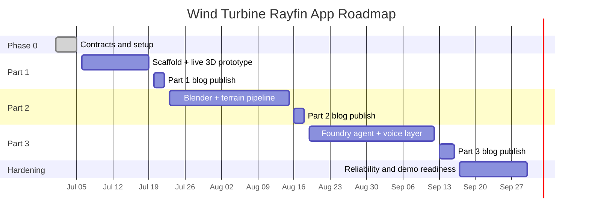

# Wind Turbine Rayfin Development Roadmap

## Timeline overview

Start date: 2026-07-01

## Sprint board

## Sprint 0: Contracts and environment (1 week)

### Goals

1. Lock data and scene contracts.
2. Finalize local-to-Fabric development workflow.

### Must complete

1. Define status thresholds and mapping table schema.
2. Define telemetry refresh policy for Part 1.
3. Create runbook for local, test, deploy.

### Done when

1. Contract doc approved.
2. End-to-end smoke test passes locally.
3. Deployment checklist reviewed.

## Sprint 1: Part 1 core build (2 weeks)

### Goals

1. Deliver minimal but live 3D twin.

### Must complete

1. Rayfin app scaffold and auth wiring.
2. Entity definitions: Turbine, Component, TurbineTelemetry.
3. Seed + telemetry generator script.
4. Three.js scene with selectable turbines.
5. Status color updates from telemetry.

### Done when

1. At least 8 turbines render and update in real time.
2. Details panel works for any selected turbine.
3. App deploys to Fabric and validates with SSO.

## Sprint 2: Part 1 polish and publish (1 week)

### Goals

1. Prepare blog-quality experience and assets.

### Must complete

1. Add filtering and stale-data UI states.
2. Capture screenshots and architecture diagrams.
3. Draft, review, and publish Part 1 post.

### Done when

1. Blog post includes reproducible steps.
2. Demo script runs without manual intervention.

## Sprint 3: Part 2 modeling pipeline (3 weeks)

### Goals

1. Replace placeholders with realistic assets.

### Must complete

1. Blender turbine model integration.
2. Terrain processing pipeline from source data.
3. Scene optimization pass (draw calls, LOD, texture budget).

### Done when

1. Realistic scene remains responsive in target environment.
2. Existing telemetry bindings still work unchanged.

## Sprint 4: Part 3 AI and voice (3 to 4 weeks)

### Goals

1. Add grounded AI interaction to the live twin.

### Must complete

1. Foundry agent backed by Fabric KQL context.
2. Text interaction tied to turbine/farm context.
3. Voice interaction path with fallback to text.
4. Basic guardrails and tracing.

### Done when

1. Agent answers are context-grounded and observable.
2. Voice and text demo path is stable.

## Sprint 5: Hardening and showcase (2 weeks)

### Goals

1. Prepare for external demos and handoff.

### Must complete

1. Performance and reliability test pass.
2. Security and auth checks pass.
3. Final demo script and troubleshooting guide.

### Done when

1. 30-minute live demo runs without blocking issue.
2. Team handoff package complete.

## Workstream ownership model

1. App and UI: front-end engineer
2. Data and telemetry: data engineer
3. Fabric deployment and auth: platform engineer
4. AI/voice layer: AI engineer
5. Blog and assets: technical writer/developer advocate

## Milestone checkpoints

1. M1: Live 3D scene with data binding (end Sprint 1)
2. M2: Part 1 published (end Sprint 2)
3. M3: Realistic visual twin (end Sprint 3)
4. M4: AI + voice integrated (end Sprint 4)
5. M5: Production-ready demo package (end Sprint 5)

## Dependency map

1. Part 2 depends on Part 1 contract stability.
2. Part 3 depends on Part 1 telemetry correctness and Part 2 scene structure.
3. Hardening depends on all prior milestones.

## Risk register snapshot

1. Data-scene key drift
2. Asset performance regressions
3. Auth behavior mismatch across environments
4. AI latency and grounding quality

## KPI scorecard

1. Build velocity: planned vs completed sprint items
2. Reliability: crash-free demo sessions
3. Performance: median frame time and update latency
4. Quality: defect leakage after each milestone
5. Documentation readiness: publish checklist completion

## Reporting cadence

1. Daily: blocker and dependency updates
2. Weekly: sprint progress and KPI snapshot
3. Milestone: go/no-go review and release notes
